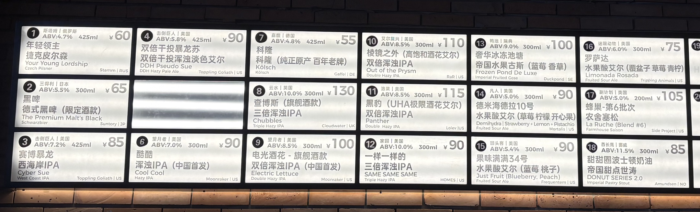
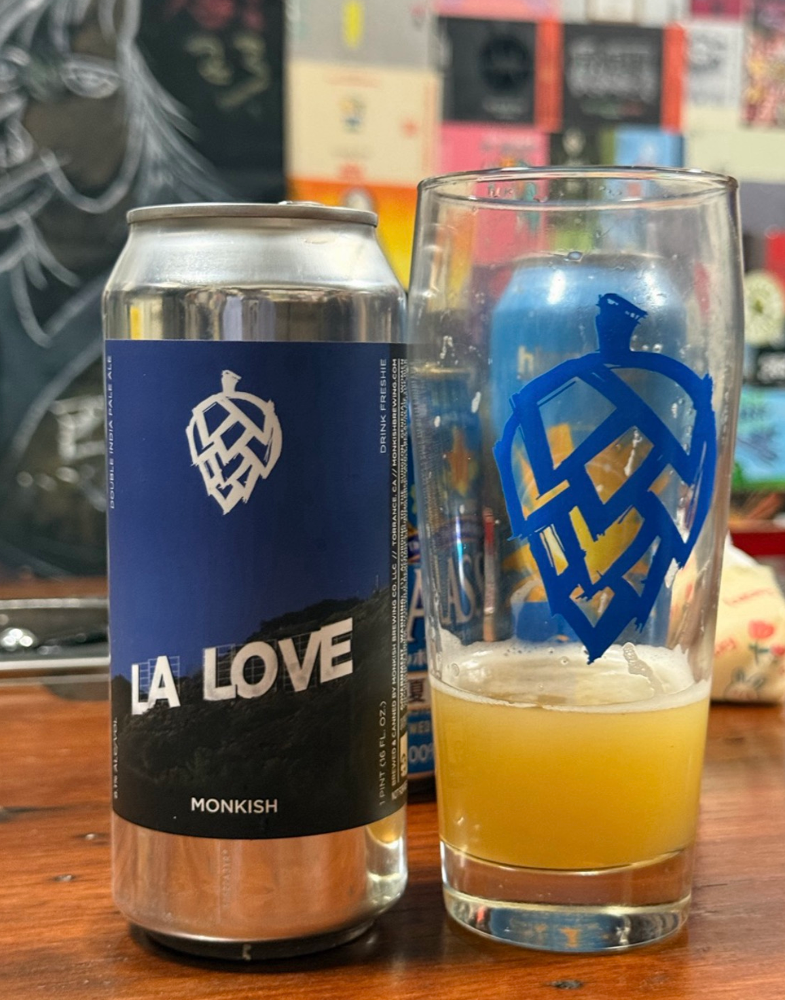
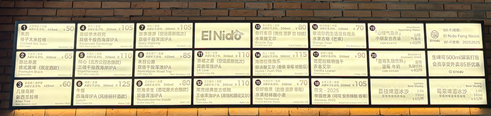
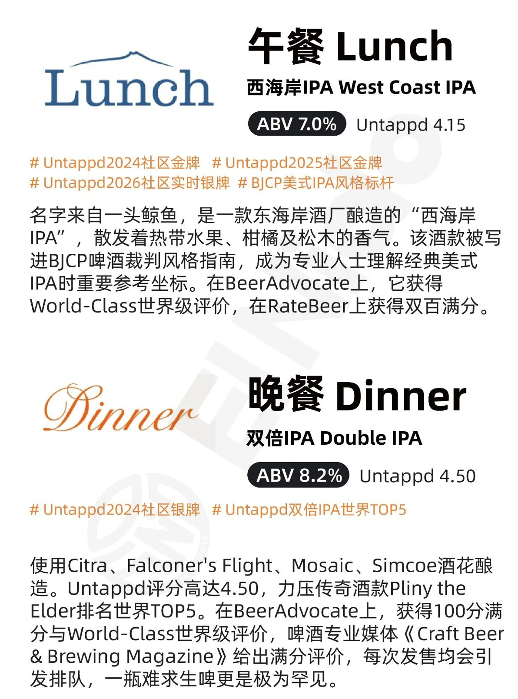

<div align="center">

<h1>🍺 Beer Lens</h1>
<h3>这张酒单，哪一杯最值得你买？</h3>
<p>面向真实点单场景的精酿购买决策助手。<br>从价格、容量、预算和口味出发，帮助你判断选哪杯、为什么值得，以及什么时候不买。</p>
<p><a href="https://github.com/peterhuang-coding/beer-lens/actions/workflows/ci.yml"></a>   </p>
<p><a href="#示例问答">示例问答</a> · <a href="#真实输入">真实输入</a> · <a href="#项目特色">项目特色</a> · <a href="#数据资产">数据资产</a> · <a href="#快速开始">快速开始</a> · <a href="#测试与进展">测试与进展</a> · <a href="docs/development.md">开发文档</a></p>

</div>

---

> “预算 70 元，想喝清爽一点的。这几款价差在哪，哪杯更适合我？”

Beer Lens 的核心目标是帮助用户做出有依据的购买选择：先满足预算与口味，再比较实际花费、容量和酒款证据，解释加价能换来什么。图像识别负责建立候选，自主整合的数据提供事实，品饮后的反馈用于检验这次选择是否值得。长期积累的是 **可核对的酒款与报价数据**，以及 **经过购买、品饮反馈验证的决策方法**。

| 从输入到选择 | 当前能力 |
| :--- | :--- |
| 📷 看懂现场 | 接收酒单、酒标图片，提取酒名、酒厂、风格与可见字段 |
| 🔎 核对酒款 | 查询本地酒库与评分缓存，结合名称、酒厂和版本线索核验匹配 |
| 🍻 帮助点单 | 结合预算、风格与口味约束组织推荐，支持围绕已有酒单继续追问 |
| 📝 记录体验 | 已有品饮反馈、口味画像与记忆纠正模块；反馈归因仍需完善 |
| 🧪 查看证据 | 提供调用轨迹、规则、Cases 审阅界面和文本／图片测试脚本 |

**当前为实验版本。** OCR、候选解析和反馈写入仍有已知缺陷；从反馈到 Skill 改进、评测和发布的完整闭环在规划中。具体边界见 [测试说明](docs/testing.md)。

预算、ABV 与 IBU 数值约束已有确定性过滤；当前菜单内的单位价、总价差和价格目标已进入推荐回复。**跨门店／市场报价、币种与消费形式的可靠比较仍未实现**。下面的主示例展示购买体验，现有能力与验收要求见 [购买决策设计](docs/purchase-decision.md)。

产品后续方向与协作入口：[调研待办与白班决策](docs/product-research-backlog.md) · [Notion 决策页](https://app.notion.com/p/3db3285284df81e397d1e520c2f7fece)（需访问权限）。

## 示例问答

### 主场景：预算内，买哪杯更值得？

**目标体验示例，尚非当前图片模型的实测输出。** 价格和容量取自下方真实测试酒单；同口径的预算、单位价和差价逻辑已有自动测试。

[](tests/fixtures/tap-list.jpg)

**Q · 用户**

> 预算 70 元，第一杯想清爽一点、不太苦，这张酒单买哪款更划算？

**A · 期望的购买建议**

> 优先考虑 **第 7 号科隆：55 元 / 425ml**，约 **12.94 元 / 100ml**。
>
> 第 1 号年轻领主是 **60 元 / 425ml**，同样容量贵 5 元；如果你更偏爱捷克皮尔森，可以为这个风格选择多花这 5 元。
>
> 第 3 号赛博暴龙是 **85 元 / 425ml**，超出预算 15 元，本轮先排除。
>
> 这里比较的是照片中的花费。单位价不能单独证明品质更好；本款苦度、新鲜度还需确认，点之前可以问店员能否试饮。

| 图中候选 | 杯价 / 容量 | 折合每 100ml | 本次取舍 |
| :--- | :--- | ---: | :--- |
| #7 科隆 · Kölsch | ¥55 / 425ml | ¥12.94 | 预算内，三款中单位价最低，优先考虑 |
| #1 年轻领主 · Czech Pilsner | ¥60 / 425ml | ¥14.12 | 同容量贵 ¥5，可按风格偏好选 |
| #3 赛博暴龙 · West Coast IPA | ¥85 / 425ml | ¥20.00 | 超预算 ¥15，本轮排除 |

这里只使用这张历史酒单的报价，未作店外市场比价。[查看数据与计算口径](docs/examples/purchase-decision.json)。

<details>
<summary><strong>当前已实测：预算不满足时，明确不推荐</strong></summary>

前置：在同一会话中已上传上面的酒单。

**Q：** 预算50元以内，只推荐符合预算的；没有就告诉我没有

**A（完整原句）：** 酒单上没有可以确认符合当前预算、风格或酒精度要求的酒，暂不推荐。可以调整要求，或补充缺失的价格/酒精度。

来自 2026-09-12 `/api/chat` 实测。[查看完整记录](docs/examples/budget-followup.json)。

</details>

<details>
<summary><strong>基础能力实测：这瓶是什么酒？</strong></summary>
<br>

<table>
<tr>
<td width="30%" align="center"></td>
<td valign="top">
<p><strong>Q · 用户</strong></p>
<p>这瓶是什么酒?</p>
<p><strong>A · Beer Lens</strong>（实际回复节选）</p>
<blockquote><p>图中酒标识别为 MONKISH / LA LOVE。<br>风格：DOUBLE INDIA PALE ALE。<br>包装/生产日期未清楚可见，新鲜度未知。</p></blockquote>
</td>
</tr>
</table>

来自 2026-09-12 的 `/api/chat` 实测，以上节选保留原句。查看 [完整输入与原始回复](docs/examples/label-check-la-love.json)。

</details>

## 真实输入

下面是仓库中实际使用的测试图片，可直接用于本地体验。它们是输入样本，不代表识别结果已经全部正确。

**酒单 · El Nido**

[](public/test-assets/menu-el-nido.png)

<details>
<summary><strong>展开更多场景：单罐酒标与营销卡片</strong></summary>
<br>
<table>
<tr>
<td align="center" width="50%"></td>
<td align="center" width="50%"></td>
</tr>
<tr>
<td align="center"><strong>单罐酒标</strong><br>辨认酒款，核对风格和酒精度。</td>
<td align="center"><strong>营销卡片</strong><br>区分酒款信息与宣传文案。</td>
</tr>
</table>
</details>

## 项目特色

**中文精酿语境。** 关注中文名、英文名、别名，以及容易混淆的酒厂和版本信息，让资料能够对应到眼前这一款酒。

**个人购买决策。** 先满足预算、口味与本次饮用场景，再比较杯价、容量和有依据的品质信息。回答需要说清首选、备选、差价与排除理由；完整实现以购买决策设计为准。

**可以检查的过程。** 将识别、查库、推荐和记忆操作放进可观察的执行流程，用案例暴露问题，并用实际结果检验改动。

**围绕“买得值不值”积累经验。** 自主整合酒款与报价证据，未来将反馈关联到实际买的酒、实付价格和容量，询问“这个价还会再买吗”，检验口味判断与溢价是否值得。数据层已有基础，交易关联与经验闭环仍在建设。

同类产品也在布局拍照选酒与口味匹配，例如开发中的 [Barley Lens](https://brewlytics.ai/lens)；[Dify](https://github.com/langgenius/dify) 和 [RAGFlow](https://github.com/infiniflow/ragflow) 则提供通用 AI 应用或知识检索能力。Beer Lens 的定位是深耕精酿点单场景，把领域数据、执行过程与体验反馈结合起来。详见 [同类项目与定位](docs/positioning.md)，这里不作未经实测的效果排名。

## 数据资产

**我们自主整合并持续维护面向精酿场景的领域数据资产。**

围绕真实点单需求，我们将多来源酒款资料、中文名称映射、酒厂与版本线索、评分记录和菜单识别证据，组织为可查询、可核对的数据层。**整合结构、匹配规则、质量检查和真实案例**，是项目持续积累的工作。

| 资产 | 用途 |
| :--- | :--- |
| 酒款资料与评分缓存 | 补充风格、酒厂和评分等背景信息 |
| 名称映射与实体匹配规则 | 连接中英文名称，减少同名、近似名和版本混淆 |
| 酒单与酒标样本 | 验证现场识别、字段提取与推荐链路 |
| 测试用例与问题案例 | 把失败转成可复现的改进任务 |

自主整合描述的是我们的整理、组织与维护工作；原始来源与证据仍保留在数据说明中。门店价格增量接入、持久化缺口队列和自动补采回写属于下一阶段，见 [数据资产说明](docs/data-assets.md)。

## 快速开始

### 只安装消费决策 Skill

面向最终用户的便携版本位于 [`skills/beer-lens/`](skills/beer-lens/)。把该目录复制到兼容 Agent 的 Skills 目录即可；它不要求最终用户登录 Untappd，也不依赖本仓库的私有数据库。宿主负责读取图片或文本，随 Skill 分发的确定性脚本负责预算、IBU、单位价与差价判断。

仓库内可以直接验证决策 helper：

```bash
npm run skill:decide -- --input skills/beer-lens/examples/menu.json
```

公共评分查询属于可选证据；无法访问时仍应依据菜单价量和用户约束完成可解释的降级回答。

### 运行完整开发项目

需要 **Node.js 22.19+**、npm 和 **Python 3.9+**（SQLite 查询使用）。

```bash
git clone https://github.com/peterhuang-coding/beer-lens.git
cd beer-lens
npm ci
cp .env.example .env.local
```

在 `.env.local` 填写 `LLM_BASE_URL`、`LLM_API_KEY`、`LLM_MODEL`，用于聊天路由。知识与视觉 Skill 的现有调用还需要 `OPENROUTER_API_KEY`；视觉模型需支持图片输入。各入口的配置关系见 [模型配置](docs/development.md#模型配置)。

```bash
npm run dev
```

打开 [localhost:3000/chat](http://localhost:3000/chat)，上传上面的测试图，或输入一个精酿问题。

| 页面 | 用途 |
| :--- | :--- |
| `/chat` | 流式对话入口 |
| `/beers` | 浏览酒库 |
| `/debug` | 查看调用、规则与 Cases |
| `/harness` | 查看 Skill 管理界面 |
| `/test-runner` | 查看并运行网页测试任务 |

## 测试与进展

以下为 **2026-09-12、代码 `2665a60` 的实测快照**，不是本次文档更新重新运行的模型测试。

| 测试层 | 结果 | 解释 |
| :--- | :--- | :--- |
| 代码测试 | 548 / 548 通过 | 同轮类型检查与生产构建通过 |
| 真实 API 文本回归 | 306 / 344 通过 | 按原有自动断言计数；存在通过但回答不正确的案例 |
| 现有 VQA 任务 | 59 / 60 通过 | 这组全部为文字输入，不能代表视觉准确率 |
| 双 API 图片检查 | 11 / 14 通过 | 覆盖 4 张独立原图，样本量有限 |

已发现的问题包括酒厂名 OCR 误读、把整句请求当酒名、否定偏好解析和反馈对象绑定错误。**自动检查通过数不等于产品准确率。** 可查看 [测试集入口、结果解读与已知缺口](docs/testing.md)。

```bash
npm run check                                      # 代码测试、类型检查、生产构建
npm run test:agent -- --write-badcases false         # 对运行中的服务做真实 API 回归
npm run benchmark:images                           # 对运行中的服务做图片检查
```

后两项需要已配置模型的服务，会产生真实模型调用；运行方式见 [测试说明](docs/testing.md#复现方式)。

### 接下来要完成

- [x] 修复连续序号追问覆盖完整菜单的问题，并补充预算、IBU 与偏好路由回归。
- [x] 打通当前菜单内的单位价比较、差价解释和价格／容量缺失提示，提供便携消费决策 Skill。
- [ ] 修复剩余候选解析、否定偏好和反馈归因问题，并验收实际记忆变化。
- [ ] 统一执行记录、Cases 与参考答案，补足字段级图片评测。
- [ ] 接入新增数据，建立有界补采、去重与质量缺口回写流程。
- [ ] 建立 Skill 新旧版本对照、独立样本验证和人工发布／回退流程。

## 开发文档

[购买决策设计](docs/purchase-decision.md) · [开发与架构](docs/development.md) · [数据资产](docs/data-assets.md) · [测试与已知问题](docs/testing.md) · [同类项目与定位](docs/positioning.md) · [数据升级设计](docs/superpowers/specs/2026-09-11-data-upgrade-crawler-design.md)

欢迎通过 [Issues](https://github.com/peterhuang-coding/beer-lens/issues) 提供可复现的问题：输入样本、预期结果、实际结果和运行版本，能直接帮助我们改进下一次点单体验。分享前请去除个人信息与密钥。
