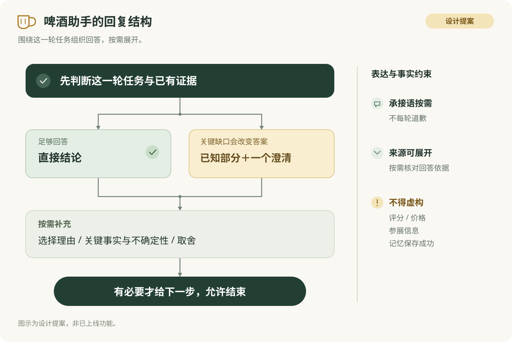

# Beer Lens回复结构与心理体验设计

> Beer Lens的回复应先帮助用户完成当前判断，再按需解释。建议以“承接、答案、依据、边界、下一步”作为可组合模块，按认酒、推荐、比价、知识、纠错等任务选择，而不是每条套五段。心理学用于减少理解负担、保留选择权和校准信任；不用于猜测人格、制造依赖或诱导多喝。以下为待验证的产品设计提案，示例不是模型实测结果。

## 一、一条回复先解决哪些问题

我建议把用户读完回复后的感受拆成五个可检查的问题：**你听懂我了吗？答案到底是什么？为什么适合我？哪些地方还不知道？我接下来可以怎么做？** 这是针对Beer Lens的设计提案，不是已被验证的心理学量表。

<table><thead><tr><th background-color="light-gray">模块</th><th background-color="light-gray">该放什么</th><th background-color="light-gray">何时出现</th><th background-color="light-gray">何时省略</th></tr></thead><tbody>
<tr><td>承接</td><td>本轮变化、仍有效的约束，或用户明确表达的困扰。例如“改为473ml，预算仍是80元”。</td><td>纠错、约束变化、多轮指代、明显受挫。</td><td>答案本身已足以说明理解，比如“这款的酒精度是5%”。</td></tr>
<tr><td>核心答案</td><td>识别结果、一个首选、比较结论、简明解释或真实执行状态。</td><td>原则上必有。信息不足时，答案就是“目前无法确定哪款/哪款更划算”，并具体说缺什么。</td><td>不能省略成只有寒暄、背景或空泛追问。</td></tr>
<tr><td>决定性依据</td><td>与用户目标相关的1–2个事实或取舍；价格、容量、风味、来源等。</td><td>推荐、比较、反直觉结论、用户问为什么。</td><td>简单已核实事实；用户只要短答。</td></tr>
<tr><td>必要边界</td><td>会改变结论的未知、条件和来源区分。优先附在对应字段或结论旁。</td><td>看不清、同名变体、价量缺失、活动名单未确认、不同来源冲突。</td><td>不能每条机械堆免责声明；无关不确定性不打断主任务。</td></tr>
<tr><td>可选下一步</td><td>一个有用的问题、补图要求或可执行选项；也可以自然结束。</td><td>缺关键输入，或确有价值的延伸任务。</td><td>问题已经答完、用户说谢谢/停止、系统实际没有支持的下一步。</td></tr>
</tbody></table>

“1–2个理由、一个首选、一个问题”是首版默认值，均应按用户任务和信息量调整。核心事实和关键不确定性不得藏到展开层；酒厂故事、完整参数、更多候选可渐进展开。渐进披露与相关、简短的对话原则支持这种信息分层，但不能推出固定字数或固定选项数最优。（来源：[Progressive Disclosure](https://www.nngroup.com/articles/progressive-disclosure/)） （来源：[Learn about conversation](https://developers.google.com/assistant/conversation-design/learn-about-conversation)）

## 二、心理学怎样落到产品，而不被滥用

<table><thead><tr><th background-color="light-gray">考虑的机制</th><th background-color="light-gray">Beer Lens设计动作</th><th background-color="light-gray">需要避免</th><th background-color="light-gray">证据边界</th></tr></thead><tbody>
<tr><td>理解负担与注意力</td><td>第一屏给结论和相关依据；使用熟悉的风味词解释术语；展开完整资料。</td><td>一开口倾倒全部参数、酒厂历史和排名。</td><td>交互设计原则；尚无本产品效果数据。</td></tr>
<tr><td>共同理解与可纠正性</td><td>“500ml改为473ml，预算不变”；允许用户直接说“不，是另一款”；支持转话题。</td><td>每次重新问完全部条件；把纠错当成新无关任务。</td><td>对话设计指南支持隐式确认和一步纠正；保存事实须与实际状态一致。</td></tr>
<tr><td>自主与胜任感</td><td>用可解释的取舍帮助选酒；保留“看更多/换方向”；问新手可回答的问题，例如“更想清爽还是浓郁”。</td><td>“懂酒的人都喝这个”“你一定会喜欢”；把选择权藏在默认推荐后。</td><td>由自我决定理论迁移而来的设计假设，不是酒类聊天机器人的直接实验结论。</td></tr>
<tr><td>信任校准</td><td>区分“图上可读”“官方资料”“基于你偏好的推测”；模糊字段就地注明；执行成功才说已完成。</td><td>没有校准的百分比置信度；不确定时用流畅长文遮掩；用图片宣传评分当当前评分。</td><td>AI交互指南与会话质量原则支持；本产品仍需测实际错误与用户依赖。</td></tr>
<tr><td>被尊重与被接住</td><td>“这杯对你来说太苦了，下一杯可以先避开类似描述。”承接用户明确说出的体验。</td><td>凭一句反馈推断人格；“我也喝过”“我懂你的所有感受”；无事也套共情话术。</td><td>关系需要可启发设计；具体措辞为产品提案，不作心理诊断或疗效承诺。</td></tr>
</tbody></table>

自我决定理论讨论自主、胜任和关系需要。这里采用它来解释为什么应让用户能理解、能纠正、能自主选择；原始论文已经读取，但其结论迁移到Beer Lens尚未核实。Google的隐式确认和纠错建议可作为独立的设计实践参照，而非该心理学理论的实验证明。（来源：[Ryan与Deci：Self-Determination Theory](https://selfdeterminationtheory.org/SDT/documents/2000_RyanDeci_SDT.pdf)） （来源：[Confirmations](https://developers.google.com/assistant/conversation-design/confirmations)）

信任设计的目标是让用户知道何时可以依赖、何时需要核对。Microsoft HAX要求说明系统能做什么、可能何时出错，并使沟通精度匹配系统表现；Google的合作原则也强调真实、相关、适量、清晰。两者支持“准确边界比显得无所不知更有用”的设计方向。（来源：[Make clear how well the system can do what it can do](https://www.microsoft.com/en-us/haxtoolkit/guideline/make-clear-how-well-the-system-can-do-what-it-can-do/)） （来源：[Learn about conversation](https://developers.google.com/assistant/conversation-design/learn-about-conversation)）

不要把“选择过载”简化为永远只给三款。2010元分析原文报告平均效应接近零、研究间差异明显，不能支持普遍的固定数量规则。本文对该研究为单一原始论文核对、未做独立复核。产品因此先按“帮我快速选”与“让我探索比较”区分：前者给首选与有意义的替代，后者提供分组列表和更多资料。（来源：[Can There Ever Be Too Many Options?](https://www.scheibehenne.com/ScheibehenneGreifenederTodd2010.pdf)） （来源：[Progressive Disclosure](https://www.nngroup.com/articles/progressive-disclosure/)）

## 三、按任务选择结构

<table><thead><tr><th background-color="light-gray">用户任务</th><th background-color="light-gray">建议结构</th><th background-color="light-gray">首要判断</th></tr></thead><tbody>
<tr><td>看图认酒</td><td>可确认身份 → 关键可读字段 → 不可确认字段 → 必要时补图。</td><td>只有杯上品牌时不能给出具体酒名；一个罐的容量不能等同一箱总量。</td></tr>
<tr><td>帮我选一杯</td><td>首选与关键约束 → 口味/价量依据 → 主要取舍 → 必要时给一个替代。</td><td>有足够候选事实才推荐；无合格候选可以明确不推荐。</td></tr>
<tr><td>值不值/哪款划算</td><td>先明确比较目标 → 同口径价量比较 → 口味或规格差异 → 缺数据时追问。</td><td>总价与单位价分开，币种、堂饮/外带、容量可比；评分不能替代价格。</td></tr>
<tr><td>风格与知识</td><td>一句核心解释 → 通俗口感锚点 → 关键区别；用户要深入再展开。</td><td>知识回答不自动转成推销；不要求用户回答无关偏好才能获得解释。</td></tr>
<tr><td>饮后反馈</td><td>承接明确体验 → 确认对象或澄清 → 对下一次选择的影响 → 如有写入报告真实状态。</td><td>“太苦”是这次体验，不自动成为长期不喜欢整个IPA类别。</td></tr>
<tr><td>纠错与换图</td><td>指出更新对象/条件 → 保留有效条件 → 给更新后的答案。</td><td>新图不能沿用旧图字段冒充识别；纠错失败不能说已经改好。</td></tr>
<tr><td>酒厂/活动探索</td><td>明确年份城市和实体 → 已确认事实 → 未确认参展/酒款 → 可继续核对的来源。</td><td>官方酒厂产品图只能证明产品材料存在，不能证明MBCB本届参展。</td></tr>
<tr><td>闲聊、谢谢、结束</td><td>自然短回应；必要时轻量承接，不强求新任务。</td><td>不为延长会话强塞“还要推荐一款吗”。</td></tr>
<tr><td>失败/不支持</td><td>当前不能完成什么 → 已确认原因或状态 → 一个真正可行的恢复动作。</td><td>服务失败与图像模糊分开。只有服务不可用时，不要求用户反复重拍。</td></tr>
</tbody></table>

默认一次只问一个会改变结论的问题。多个缺口相互依赖时，先问信息价值最高的一个；已有上下文能解答的不要重复问。对话失败时应改变提示、增加有效线索，而不是循环相同问题。这里从以语音为背景的设计指南借鉴交互原则，不照搬其语音退出次数到文字聊天。（来源：[Questions](https://developers.google.com/assistant/conversation-design/questions)） （来源：[Errors](https://developers.google.com/assistant/conversation-design/errors)）

## 四、放到Beer Lens里是什么样

以下均为设计样例，非真实模型输出；价格示例为明确的合成报价，不代表商品现价。

<table><thead><tr><th background-color="light-gray">输入或情境</th><th background-color="light-gray">建议回复</th><th background-color="light-gray">为什么这样写</th></tr></thead><tbody>
<tr><td>IMG-E001：京A杯装照片；“这是什么酒？”</td><td>杯上能看到京A标志，但仅凭杯子和酒液颜色，还不能确定具体是哪款。补一张瓶身酒标或菜单里的酒名，我就能继续帮你确认。</td><td>可见品牌与来源网页酒名分开；不从背景生姜推断成分。</td></tr>
<tr><td>有清晰报价：小杯45元/300ml，大杯60元/500ml；预算50元，只喝300ml。</td><td>选45元的小杯，它同时符合50元预算和300ml容量。大杯虽然每100ml更便宜，但总价和容量都不符合这次要求。</td><td>先结论，再解释硬约束优先；无必要追问。</td></tr>
<tr><td>“容量改为473ml，预算不变。”</td><td>改为473ml，预算仍是80元。接下来按这两个条件筛选；容量没标清的酒先列为待确认。</td><td>只承接变化和仍有效条件；原来预算必须确为80元。</td></tr>
<tr><td>“Lunch和Dinner哪款性价比高？”只有名字，没有报价容量。</td><td>现在还不能判断哪款更划算，缺少同一购买场景下的报价和容量。把两款的售价和毫升数发来，我可以一起比较总价和每100ml价格。</td><td>不拿评分代替性价比，不编造一款赢家。</td></tr>
<tr><td>“刚才那杯太苦了，不要保存我的偏好。”对象已明确，禁写已执行。</td><td>这杯对你来说太苦了。下一杯可以先避开类似的苦味描述；这次只用于当前对话，没有保存为长期偏好。</td><td>承接体验、提供选择帮助；只有实际未写入才允许最后一句。</td></tr>
<tr><td>“什么是NEIPA？”</td><td>NEIPA通常指新英格兰风格IPA，常见浑浊外观和明显的酒花香气。不过“浑浊”不代表一定不苦，具体还要看酒款。</td><td>先解释用户问的概念；具体酒类知识上线前应接可靠知识来源，此例展示结构。</td></tr>
<tr><td>上传MBCB海报：“这些酒厂都来吗？”</td><td>这张海报能确认活动信息，但没有可核实的逐厂名单。我暂时不能据此确认哪些酒厂参展；你发的若是2025海报，也不能用来证明2026阵容。</td><td>把年份、名单和产品图库分开；不以知名度猜阵容。</td></tr>
<tr><td>图片识别服务不可用</td><td>这次没有完成图片识别，识图服务暂时不可用。图片和问题可以保留，恢复后再继续；目前不能给出这张图的酒名。</td><td>用户不需要看到内部端口或报错栈；能否保留图片须按实际产品能力决定。</td></tr>
</tbody></table>

承接也要有节制。不是每次开头都写“好的”“懂你”“很棒的问题”；有实际修改或拒绝时，用准确的反馈维持对话连续性。Google提醒重复使用同样的确认词会使体验单调；其确认指南也允许在动作本身已清楚时省略确认。（来源：[Acknowledgements](https://developers.google.com/assistant/conversation-design/acknowledgements)） （来源：[Confirmations](https://developers.google.com/assistant/conversation-design/confirmations)）

## 五、图片扩充怎样服务于回复设计

本轮在上一轮36个图片文件之外，已额外下载并人工目检33张官方来源图：京A16张、Toppling Goliath 5张、Side Project 10张、Other Half 2张。当前是“素材与对象边界已复核、完整字段答案待标注、真实模型未执行”。这些是本地下载和哈希统计，不是识图成功率；截至本稿生成时新增现场菜单照片仍为0。

<table><thead><tr><th background-color="light-gray">素材类型</th><th background-color="light-gray">代表样本</th><th background-color="light-gray">检验回复的什么能力</th></tr></thead><tbody>
<tr><td>品牌杯与无酒名场景</td><td>IMG-E001、005、006、012、014</td><td>说出能确认的品牌，同时拒绝从酒色或网页背景补酒名。</td></tr>
<tr><td>双语酒款海报</td><td>IMG-E004、007、009、011、013、015</td><td>酒名、品牌、口号和风格归属；ABV、IBU分开；按需解释。</td></tr>
<tr><td>同系列相似包装</td><td>IMG-E020、022、025、026、028</td><td>不串酒款与变体；区别无酒精款与普通款。</td></tr>
<tr><td>极简或深色标签</td><td>IMG-E029至038</td><td>可读身份先答，细字未知就地说明；不从来源页补版本年份。</td></tr>
<tr><td>历史奖项宣传</td><td>IMG-E032</td><td>图示2020奖项不等于当前评分或2026版本获奖。</td></tr>
<tr><td>多罐合影/无酒精包装</td><td>IMG-E040、041</td><td>包装数量不等于酒款数量；“non-alcoholic”不自动改写为绝对零酒精。</td></tr>
</tbody></table>

后续标注应同时保存可见字段、不可见字段、来源网页事实及两者冲突。照片和海报、同款不同视角、相似系列需按酒款族分组，避免训练/评测两侧出现同族泄漏。上述是数据设计提案，尚未进行训练或新的模型回归。MBCB参展资格继续记未确认。

## 六、怎样判断这个结构是否有用

不能只看回复更长、用户多聊了几轮或点了更多按钮。建议围绕“用户是否更快完成判断，同时知道答案的边界”评估；具体阈值须先取得基线。这是验收方向，未执行用户实验。

<table><thead><tr><th background-color="light-gray">维度</th><th background-color="light-gray">观察方式</th><th background-color="light-gray">不接受的捷径</th></tr></thead><tbody>
<tr><td>正确与诚实</td><td>字段准确、约束遵守、图源/知识源区分、未知处理、执行状态真实。</td><td>关键事实编造，即使其他维度高分也不通过。</td></tr>
<tr><td>看懂并完成</td><td>用户能复述首选和关键理由；完成选择所需时间；必要追问轮次。</td><td>强行缩短回复导致隐去重要条件。</td></tr>
<tr><td>上下文连续</td><td>修改容量只替换容量；换图更新实体；一句话能纠正；不重复问已知信息。</td><td>结尾答对掩盖中间误导。</td></tr>
<tr><td>信任恰当</td><td>用户能区分已确认与推测；遇到模糊酒标是否愿意核对。</td><td>只有“感觉专业/喜欢”评分，没有事实对照。</td></tr>
<tr><td>自主与舒适</td><td>能拒绝推荐、查看替代、结束对话；是否感到被催促或评判。</td><td>以增加饮酒量或延长会话作为单一成功指标。</td></tr>
</tbody></table>

优先比较两种真实有差别的首版：A为“答案＋一个关键理由＋必要边界”，B为“答案＋简短对比卡＋必要边界”。在相同候选事实、相同问题、相同模型设置下比较；将用户随机分到顺序并平衡材料，区分新手/熟悉精酿、快速选择/探索任务。先用小规模任务观察找明显问题，再决定正式样本量与上线指标，不能预报提升百分比。

> 本轮完成的是素材扩充与回复设计研究，没有修改回复生成代码，也没有新增真实识图通过记录。现有模型配置仍缺失。Google所引指南来自已停止的Conversational Actions产品背景，仅借鉴对话原则；理论和通用指南向啤酒助手的迁移需通过本产品验证。

---

## 七、测试集与改动点对照

> 代码修复、素材扩充与回复设计分开记录：容量缺陷已修复并通过离线回归；33张新增图尚未跑模型；回复结构仍为待实施提案。79/79仅属于此前容量修复相关离线回归，不能代表33张新图或回复设计验收通过。

<a href="https://bytedance.larkoffice.com/docx/KsgDdM4mroTaPdxEIHzcMV7Znib">打开完整测试集、历史修复与实际结果</a>

<a href="https://bytedance.larkoffice.com/docx/KsgDdM4mroTaPdxEIHzcMV7Znib#doxcnAePs10BA6hIh3kAZNzB4Fc">直接查看新增33张图片测试清单</a>
<table><thead><tr><th background-color="light-gray">改动点</th><th background-color="light-gray">具体内容</th><th background-color="light-gray">实施状态</th><th background-color="light-gray">对应测试与验收状态</th></tr></thead><tbody><tr><td>容量表达修复</td><td>支持“容量改为473ml”替换旧容量，保留原预算。</td><td>已写入代码工作区，尚未部署。</td><td>UT-I08原断言通过；本轮41条加38条相关回归共79/79通过，0跳过。</td></tr><tr><td>新增33张图片</td><td>补京A、Toppling Goliath、Side Project、Other Half；增加品牌杯、双语海报、相似包装和无酒精边界。</td><td>已下载、去重和人工目检；完整字段答案待标注。</td><td>原测试表第七节33行含编号、query、来源、原图链接与状态；真实模型未执行。</td></tr><tr><td>按任务组合回复</td><td>承接、答案、依据、边界、下一步按需出现；覆盖认酒、推荐、比价、知识、反馈、纠错、活动、闲聊与失败。</td><td>设计提案，回复生成代码未修改。</td><td>本文第三、四节为模板与样例；尚未添加和执行回复结构专项断言。</td></tr><tr><td>上下文承接与少追问</td><td>复用有效条件、支持一句话纠正；仅在关键缺口影响结论时追问。</td><td>设计提案；既有底层约束修复不等于回复体验已验收。</td><td>既有多轮与纠错GUI可作基线；模型前置仍受阻，需补结构验收。</td></tr><tr><td>事实与不确定性分开</td><td>区别图上所见、外部资料、偏好推断；未知字段就地说明，不把宣传与参展猜测当事实。</td><td>设计提案；新图完整参考答案仍待完善。</td><td>既有36图逐字段用例保留；新增33图只有候选问题和测试重点，未算模型通过。</td></tr><tr><td>控制感和自然结束</td><td>给理由和取舍，允许改方向或结束；避免机械共情、反复道歉和强塞追问。</td><td>设计提案，尚未做用户实验。</td><td>本文第六节提供评价维度；没有宣称已提升满意度或任务成功率。</td></tr><tr><td>真实失败与保存状态</td><td>服务失败不当作图像模糊；操作实际成功才说完成，禁写状态据真实副作用判断。</td><td>设计提案，需结合实际实现验收。</td><td>既有GUI 48条整体受阻：46条模型用例未执行；2条UI已执行，7点中5通过、2点UNKNOWN。</td></tr></tbody></table>
