# 图片测试集

共69个图片文件：63张来源图、6张衍生图。包含4张旧基线、26张第一批新增图及33张扩充图；来源图不等于不同酒款数。新增现场菜单照片为0。

前36张的参考答案已冻结，逐字段识图用例受项目模型配置阻塞；后33张仅完成人工目检与测试重点，完整字段待标注、模型未执行。MBCB逐厂参展资格均未核实。

[原36图验收用例](图片验收用例.md) · [MBCB参数化模板](MBCB待实例化用例.md) · [完整JSON清单](../../tests/fixtures/image-dataset/manifest.json) · [图片参考答案](../../tests/fixtures/image-dataset/图片参考答案.md) · [飞书协作表格](https://bytedance.larkoffice.com/docx/KsgDdM4mroTaPdxEIHzcMV7Znib)

|编号|图片|问题与重点|标注/执行状态|来源|
|---|---|---|---|---|
|IMG-N001|<a href="../../tests/fixtures/image-dataset/images/IMG-N001.png">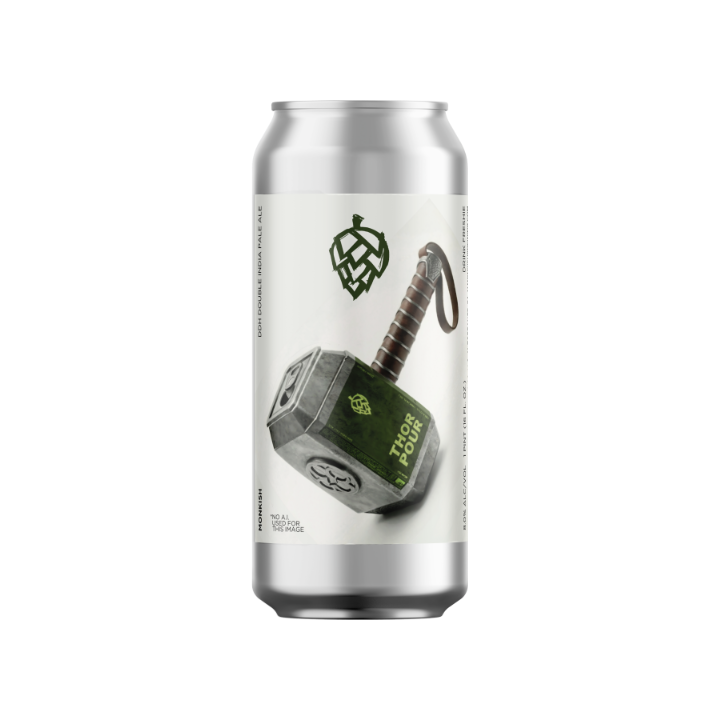</a> Thor Pour|请只根据图片说明画面对象、酒名、酒厂、风格、ABV和容量；看不清的请明确说明，图中没有的价格和评分不要补造。 逐字段识别、来源边界与上下文正确性|参考答案已冻结；识图受阻|[官方页面](https://shop.monkishbrewing.com/products/thor-pour-ddh-dipa-4pk-16oz)|
|IMG-N002|<a href="../../tests/fixtures/image-dataset/images/IMG-N002.png">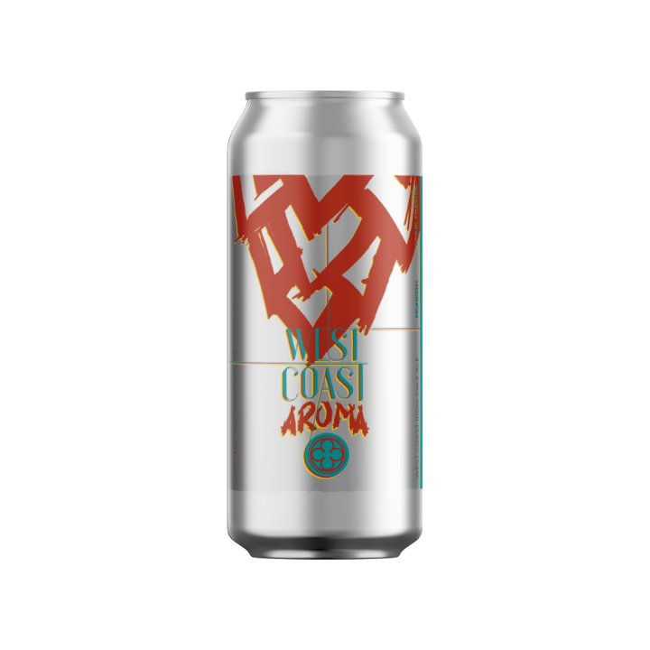</a> West Coast Aroma|请只根据图片说明画面对象、酒名、酒厂、风格、ABV和容量；看不清的请明确说明，图中没有的价格和评分不要补造。 逐字段识别、来源边界与上下文正确性|参考答案已冻结；识图受阻|[官方页面](https://shop.monkishbrewing.com/products/west-coast-aroma-wc-ipa-4pk-16oz)|
|IMG-N003|<a href="../../tests/fixtures/image-dataset/images/IMG-N003.png">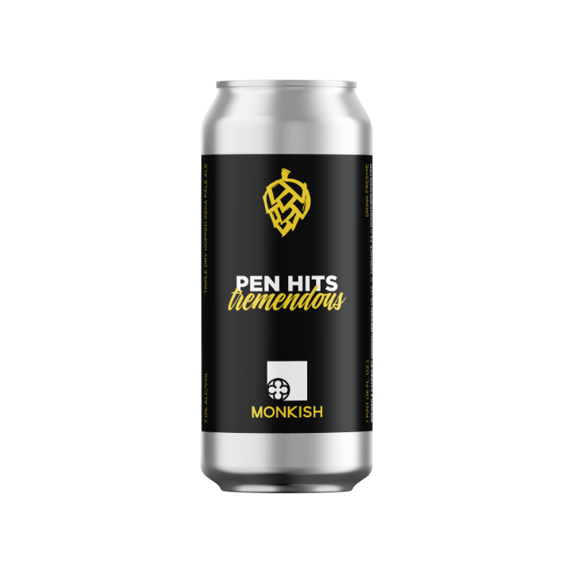</a> Pen Hits Tremendous|请只根据图片说明画面对象、酒名、酒厂、风格、ABV和容量；看不清的请明确说明，图中没有的价格和评分不要补造。 逐字段识别、来源边界与上下文正确性|参考答案已冻结；识图受阻|[官方页面](https://shop.monkishbrewing.com/products/pen-hits-tremendous-tdh-ipa4pk-16oz)|
|IMG-N004|<a href="../../tests/fixtures/image-dataset/images/IMG-N004.jpg">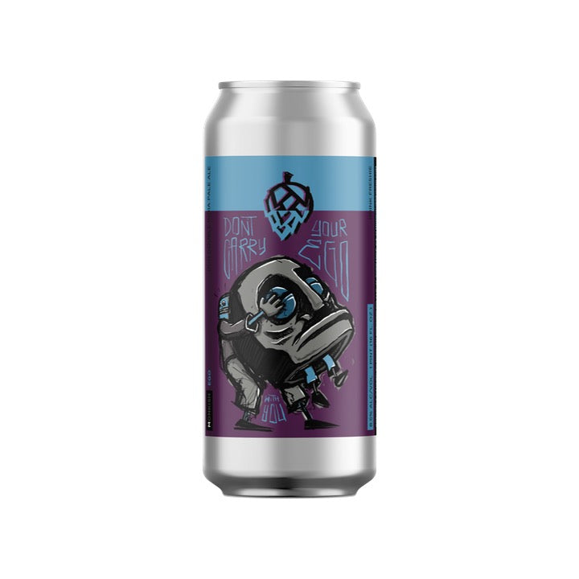</a> Ego|请只根据图片说明画面对象、酒名、酒厂、风格、ABV和容量；看不清的请明确说明，图中没有的价格和评分不要补造。 逐字段识别、来源边界与上下文正确性|参考答案已冻结；识图受阻|[官方页面](https://shop.monkishbrewing.com/products/ego-ddh-dipa-4pk-16oz)|
|IMG-N005|<a href="../../tests/fixtures/image-dataset/images/IMG-N005.png">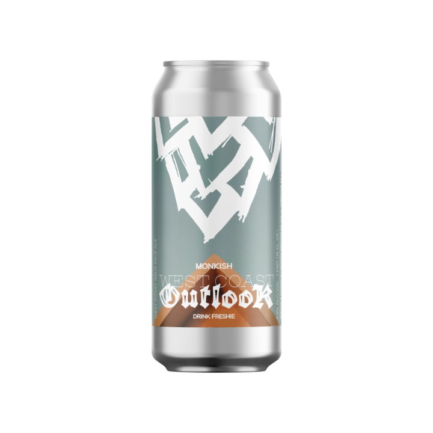</a> West Coast Outlook|请只根据图片说明画面对象、酒名、酒厂、风格、ABV和容量；看不清的请明确说明，图中没有的价格和评分不要补造。 逐字段识别、来源边界与上下文正确性|参考答案已冻结；识图受阻|[官方页面](https://shop.monkishbrewing.com/products/west-coast-outlook-wc-ipa-4pk-16oz)|
|IMG-N006|<a href="../../tests/fixtures/image-dataset/images/IMG-N006.jpg">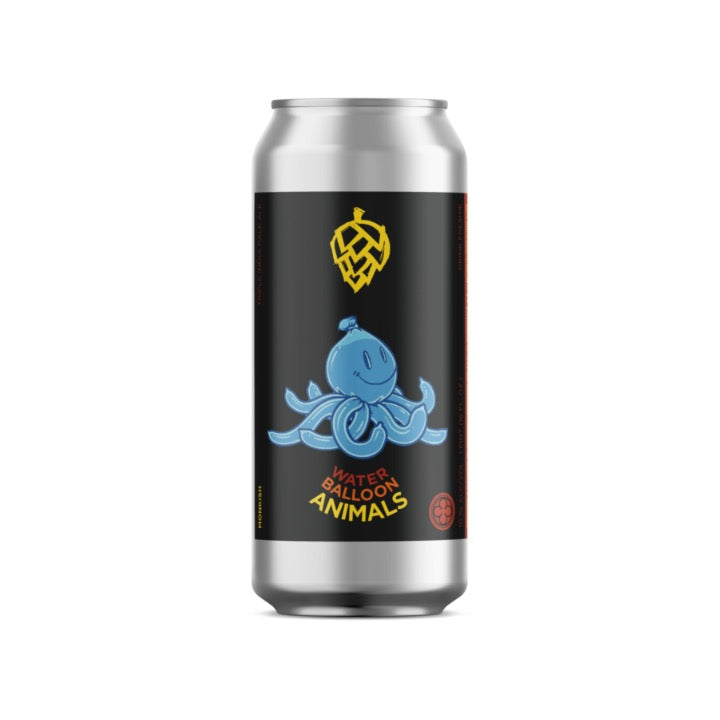</a> Water Balloon Animals|请只根据图片说明画面对象、酒名、酒厂、风格、ABV和容量；看不清的请明确说明，图中没有的价格和评分不要补造。 逐字段识别、来源边界与上下文正确性|参考答案已冻结；识图受阻|[官方页面](https://shop.monkishbrewing.com/products/water-balloon-animals-tipa-4pk-16oz)|
|IMG-N007|<a href="../../tests/fixtures/image-dataset/images/IMG-N007.jpg">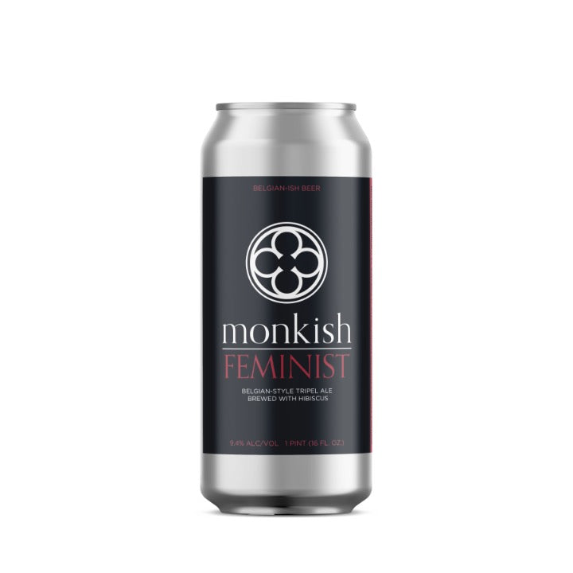</a> Feminist|请只根据图片说明画面对象、酒名、酒厂、风格、ABV和容量；看不清的请明确说明，图中没有的价格和评分不要补造。 逐字段识别、来源边界与上下文正确性|参考答案已冻结；识图受阻|[官方页面](https://shop.monkishbrewing.com/products/feminist-belgian-tripel-4pk-16oz)|
|IMG-N008|<a href="../../tests/fixtures/image-dataset/images/IMG-N008.jpg">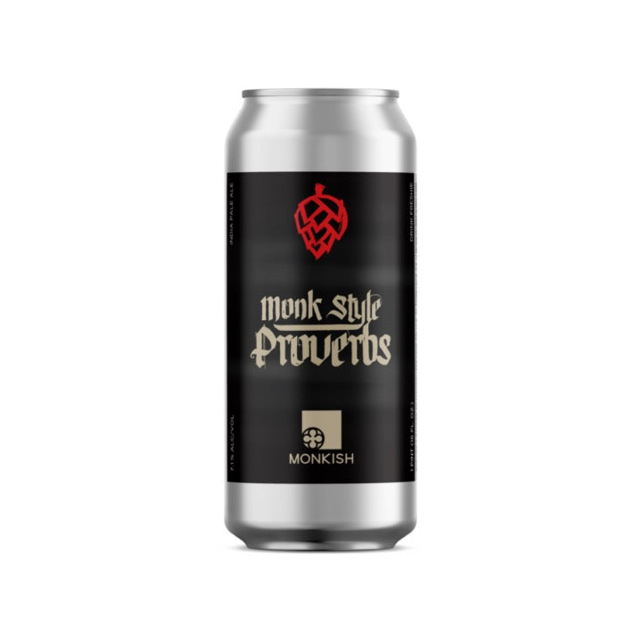</a> Monk-Style Proverbs|请只根据图片说明画面对象、酒名、酒厂、风格、ABV和容量；看不清的请明确说明，图中没有的价格和评分不要补造。 逐字段识别、来源边界与上下文正确性|参考答案已冻结；识图受阻|[官方页面](https://shop.monkishbrewing.com/products/monk-style-proverbs-ipa-4pk-16oz)|
|IMG-N009|<a href="../../tests/fixtures/image-dataset/images/IMG-N009.png">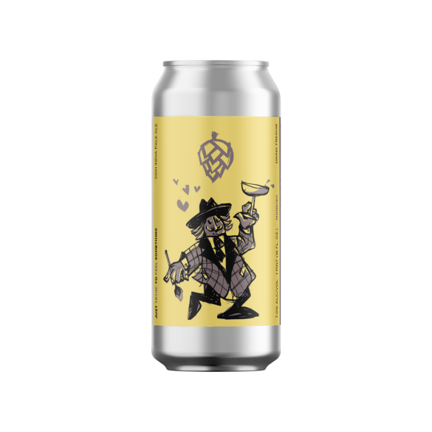</a> Just Tryin' to Feel Something|请只根据图片说明画面对象、酒名、酒厂、风格、ABV和容量；看不清的请明确说明，图中没有的价格和评分不要补造。 逐字段识别、来源边界与上下文正确性|参考答案已冻结；识图受阻|[官方页面](https://shop.monkishbrewing.com/products/hay-cuz-ddh-ipa-4pk-16oz-copy)|
|IMG-N010|<a href="../../tests/fixtures/image-dataset/images/IMG-N010.jpg">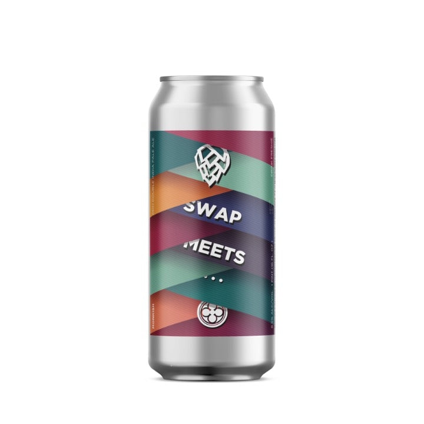</a> Swap Meets|请只根据图片说明画面对象、酒名、酒厂、风格、ABV和容量；看不清的请明确说明，图中没有的价格和评分不要补造。 逐字段识别、来源边界与上下文正确性|参考答案已冻结；识图受阻|[官方页面](https://shop.monkishbrewing.com/products/swap-meets-4pk-16oz)|
|IMG-N011|<a href="../../tests/fixtures/image-dataset/images/IMG-N011.jpg">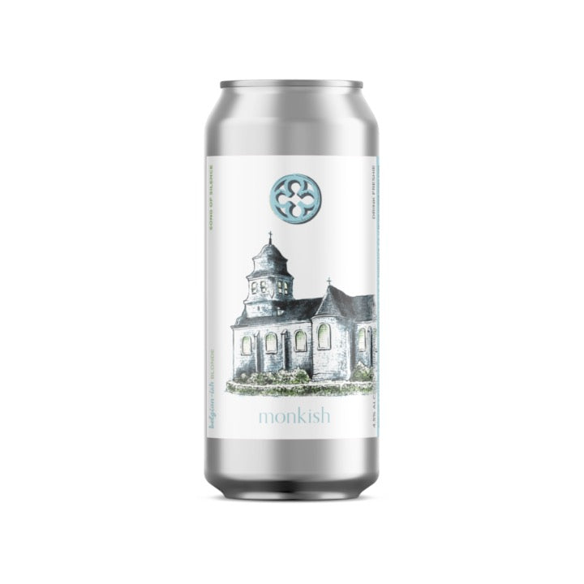</a> Song of Silence|请只根据图片说明画面对象、酒名、酒厂、风格、ABV和容量；看不清的请明确说明，图中没有的价格和评分不要补造。 逐字段识别、来源边界与上下文正确性|参考答案已冻结；识图受阻|[官方页面](https://shop.monkishbrewing.com/products/song-of-silence-belgian-blonde-4pk-16oz)|
|IMG-N012|<a href="../../tests/fixtures/image-dataset/images/IMG-N012.jpg">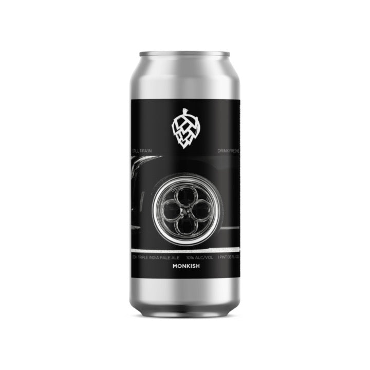</a> Still TIPA'in|请只根据图片说明画面对象、酒名、酒厂、风格、ABV和容量；看不清的请明确说明，图中没有的价格和评分不要补造。 逐字段识别、来源边界与上下文正确性|参考答案已冻结；识图受阻|[官方页面](https://shop.monkishbrewing.com/products/still-tipain-ddh-tipa-4pk-16oz)|
|IMG-N013|<a href="../../tests/fixtures/image-dataset/images/IMG-N013.jpg">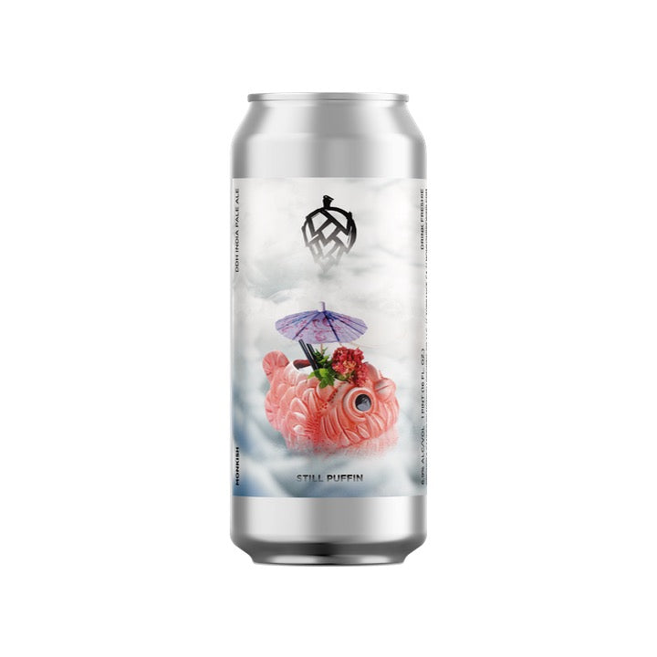</a> Still Puffin|请只根据图片说明画面对象、酒名、酒厂、风格、ABV和容量；看不清的请明确说明，图中没有的价格和评分不要补造。 逐字段识别、来源边界与上下文正确性|参考答案已冻结；识图受阻|[官方页面](https://shop.monkishbrewing.com/products/still-puffin-ipa-4pk-16oz)|
|IMG-N014|<a href="../../tests/fixtures/image-dataset/images/IMG-N014.png">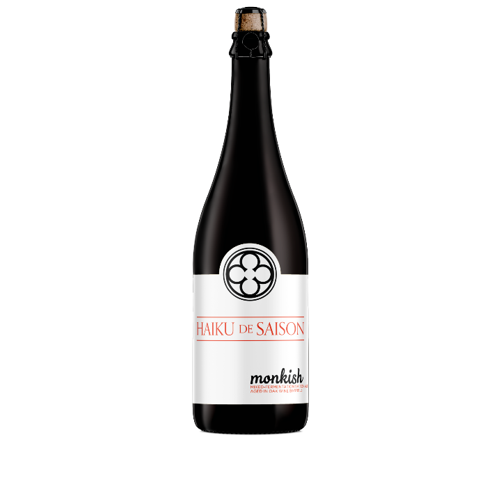</a> Haiku de Saison|请只根据图片说明画面对象、酒名、酒厂、风格、ABV和容量；看不清的请明确说明，图中没有的价格和评分不要补造。 逐字段识别、来源边界与上下文正确性|参考答案已冻结；识图受阻|[官方页面](https://shop.monkishbrewing.com/products/interstellar-hitchhiker-750ml-bottle-copy)|
|IMG-N015| Lunch|请只根据图片说明画面对象、酒名、酒厂、风格、ABV和容量；看不清的请明确说明，图中没有的价格和评分不要补造。 逐字段识别、来源边界与上下文正确性|参考答案已冻结；识图受阻|[官方页面](https://mainebeercompany.com/beer/lunch)|
|IMG-N016| Peeper|请只根据图片说明画面对象、酒名、酒厂、风格、ABV和容量；看不清的请明确说明，图中没有的价格和评分不要补造。 逐字段识别、来源边界与上下文正确性|参考答案已冻结；识图受阻|[官方页面](https://mainebeercompany.com/beer/peeper)|
|IMG-N017|<a href="../../tests/fixtures/image-dataset/images/IMG-N017.png">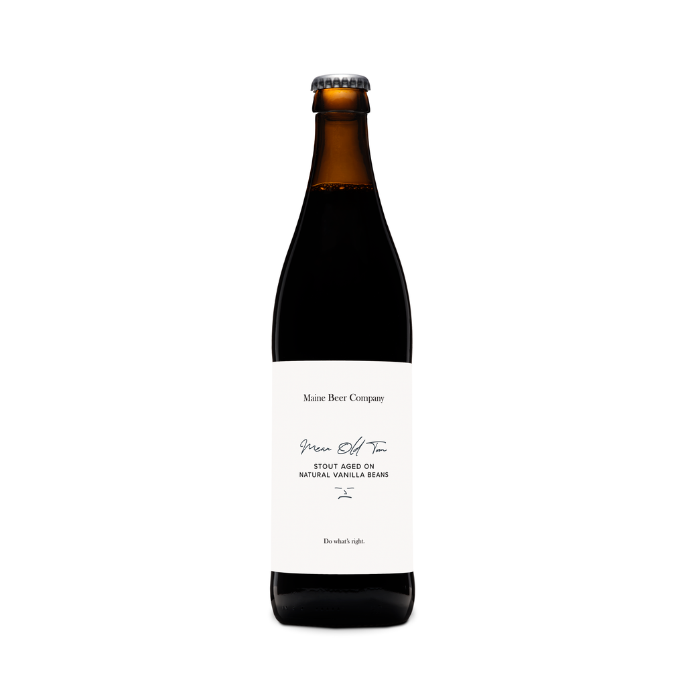</a> Mean Old Tom|请只根据图片说明画面对象、酒名、酒厂、风格、ABV和容量；看不清的请明确说明，图中没有的价格和评分不要补造。 逐字段识别、来源边界与上下文正确性|参考答案已冻结；识图受阻|[官方页面](https://mainebeercompany.com/beer/mean-old-tom)|
|IMG-N018|<a href="../../tests/fixtures/image-dataset/images/IMG-N018.png">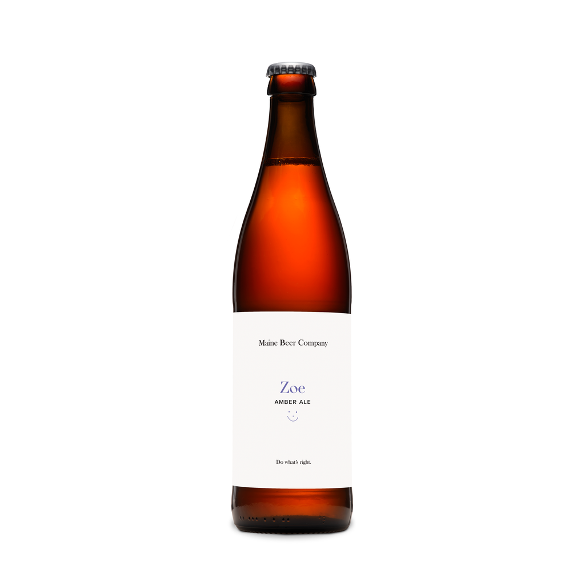</a> Zoe|请只根据图片说明画面对象、酒名、酒厂、风格、ABV和容量；看不清的请明确说明，图中没有的价格和评分不要补造。 逐字段识别、来源边界与上下文正确性|参考答案已冻结；识图受阻|[官方页面](https://mainebeercompany.com/beer/zoe)|
|IMG-N019|<a href="../../tests/fixtures/image-dataset/images/IMG-N019.png">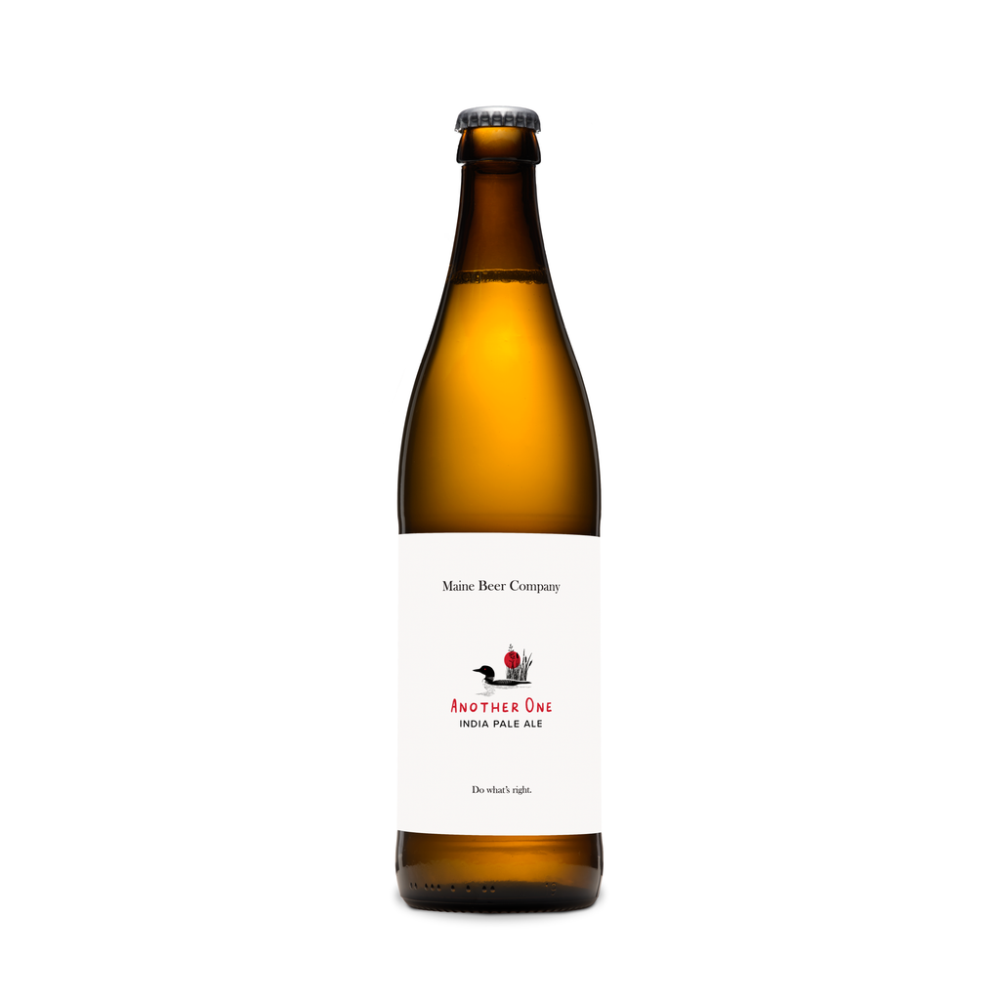</a> Another One|请只根据图片说明画面对象、酒名、酒厂、风格、ABV和容量；看不清的请明确说明，图中没有的价格和评分不要补造。 逐字段识别、来源边界与上下文正确性|参考答案已冻结；识图受阻|[官方页面](https://mainebeercompany.com/beer/another-one)|
|IMG-N020| Woods & Waters|请只根据图片说明画面对象、酒名、酒厂、风格、ABV和容量；看不清的请明确说明，图中没有的价格和评分不要补造。 逐字段识别、来源边界与上下文正确性|参考答案已冻结；识图受阻|[官方页面](https://mainebeercompany.com/beer/woods-waters)|
|IMG-N021| MO|请只根据图片说明画面对象、酒名、酒厂、风格、ABV和容量；看不清的请明确说明，图中没有的价格和评分不要补造。 逐字段识别、来源边界与上下文正确性|参考答案已冻结；识图受阻|[官方页面](https://mainebeercompany.com/beer/mo)|
|IMG-N022| Dinner|请只根据图片说明画面对象、酒名、酒厂、风格、ABV和容量；看不清的请明确说明，图中没有的价格和评分不要补造。 逐字段识别、来源边界与上下文正确性|参考答案已冻结；识图受阻|[官方页面](https://mainebeercompany.com/beer/dinner)|
|IMG-N023|<a href="../../tests/fixtures/image-dataset/images/IMG-N023.webp">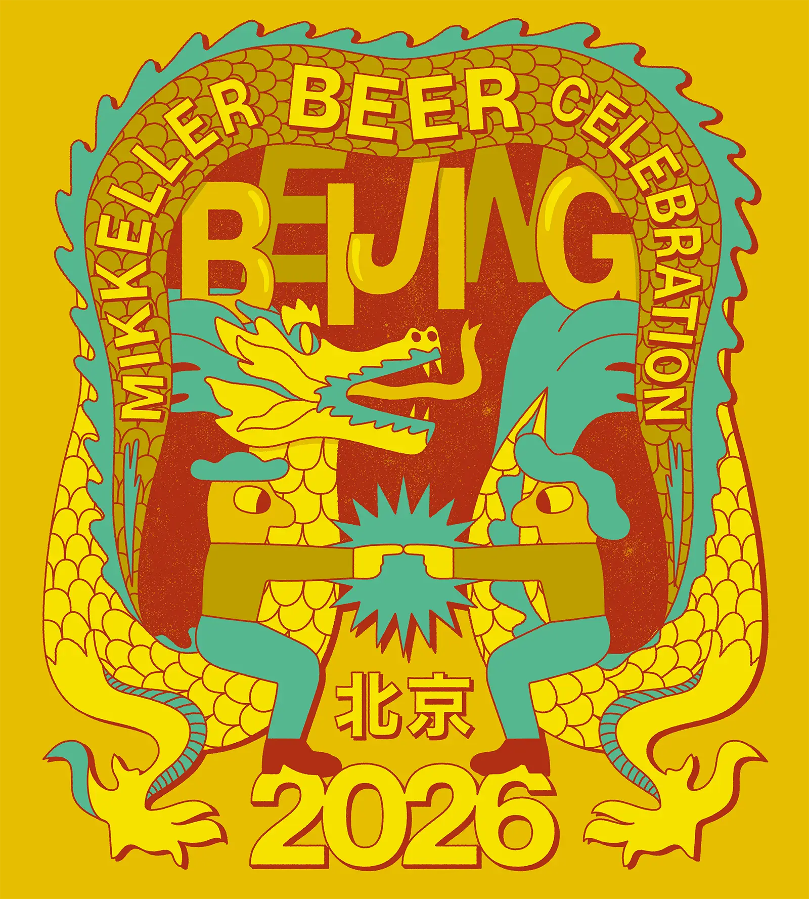</a> MBCB 2026 活动海报|这张图是什么活动、哪个城市和哪一年？仅凭这张图能否确认该届活动的参展酒厂和现场酒款？ 逐字段识别、来源边界与上下文正确性|参考答案已冻结；识图受阻|[官方页面](https://www.mikkeller.com/news/mikkeller-beer-celebration-beijing-is-back)|
|IMG-N024|<a href="../../tests/fixtures/image-dataset/images/IMG-N024.png">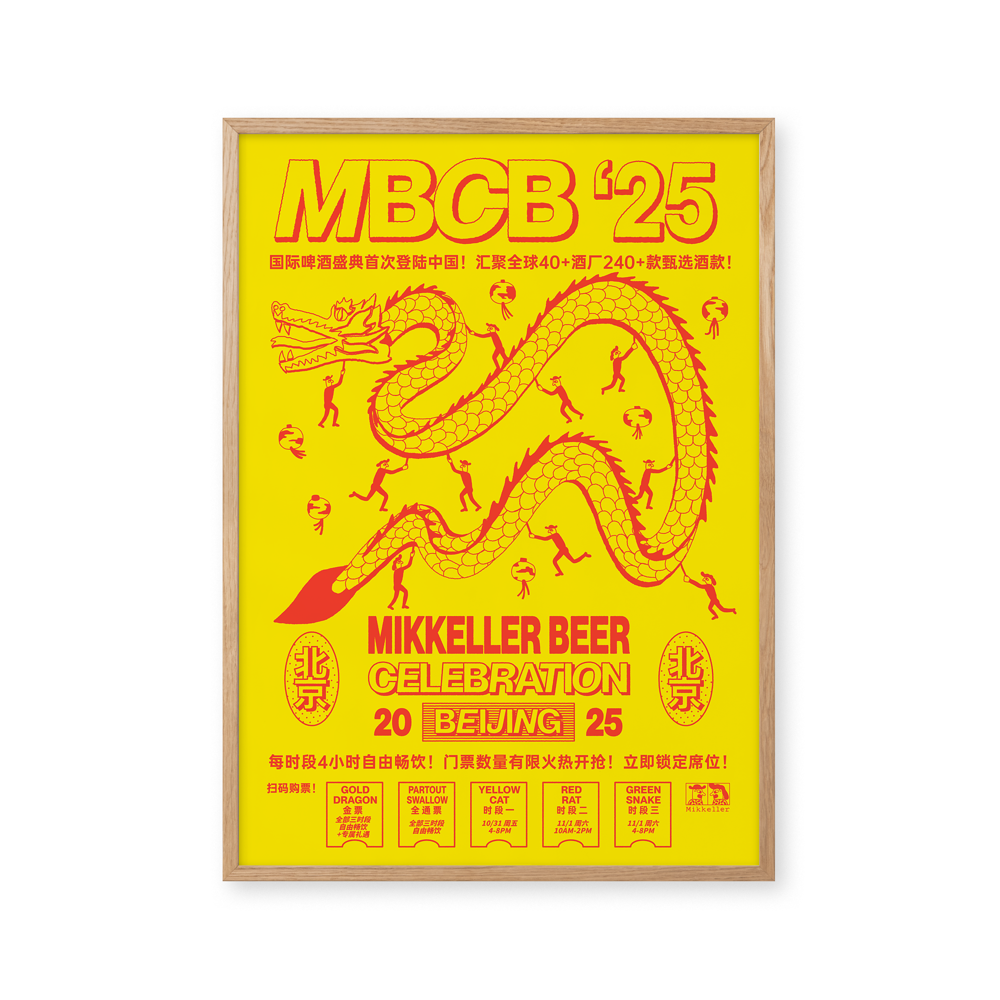</a> MBCB 25 纪念海报|这张图是什么活动、哪个城市和哪一年？仅凭这张图能否确认该届活动的参展酒厂和现场酒款？ 逐字段识别、来源边界与上下文正确性|参考答案已冻结；识图受阻|[官方页面](https://prints.mikkeller.com/products/mbcb-25)|
|IMG-N025|<a href="../../tests/fixtures/image-dataset/images/IMG-N025.png">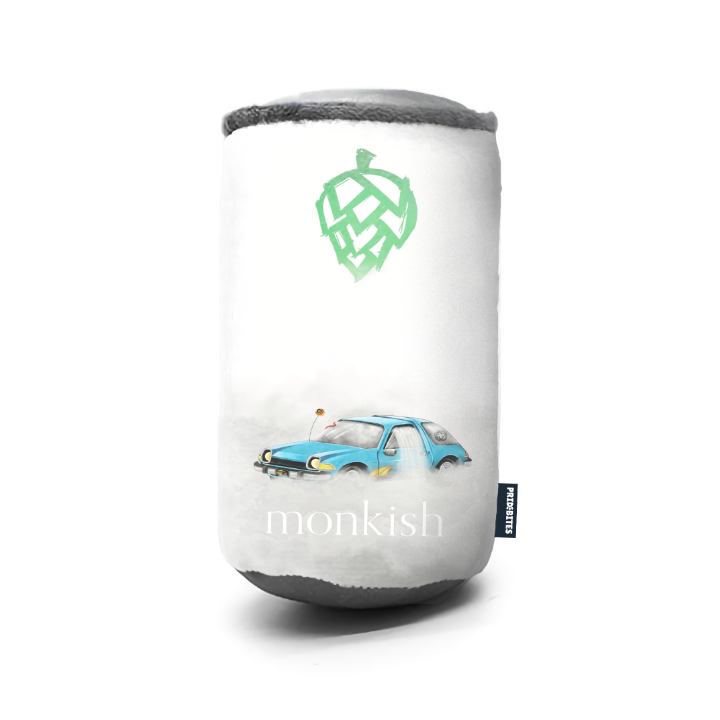</a> Dog Plush Toy: Foggy Window Can|图里是什么物品？这是实际啤酒吗？能否仅据此确定酒款、ABV和容量？ 逐字段识别、来源边界与上下文正确性|参考答案已冻结；识图受阻|[官方页面](https://shop.monkishbrewing.com/products/dog-plush-toy-foggy-window-can)|
|IMG-N026|<a href="../../tests/fixtures/image-dataset/images/IMG-N026.png">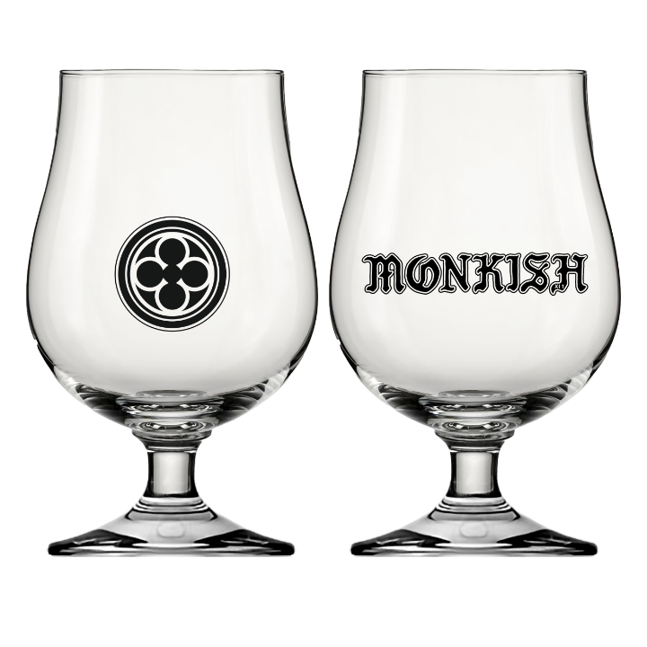</a> Glassware - Logo - Luttich 4cl|图里是什么物品？图片是否足以确认某款啤酒、ABV和酒液容量？ 逐字段识别、来源边界与上下文正确性|参考答案已冻结；识图受阻|[官方页面](https://shop.monkishbrewing.com/products/tulip-glassware-amigas-luttich-4l)|
|IMG-B001|<a href="../../tests/fixtures/tap-list.jpg">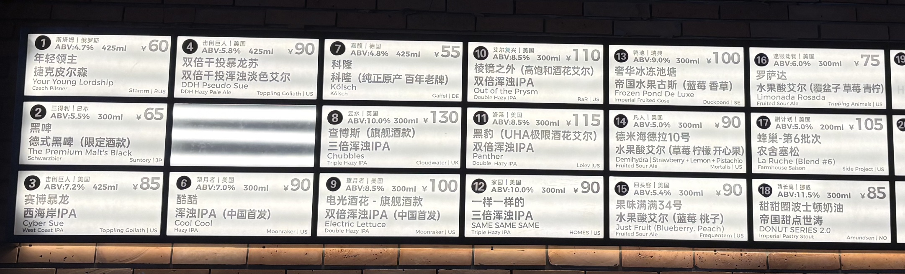</a> IMG-B001|请逐行识别这张酒单，保留印刷编号、酒名、酒厂、价格和容量；看不清的字段请说明 逐字段识别、来源边界与上下文正确性|参考答案已冻结；识图受阻|仓库既有基线|
|IMG-B002|<a href="../../public/test-assets/menu-el-nido.png">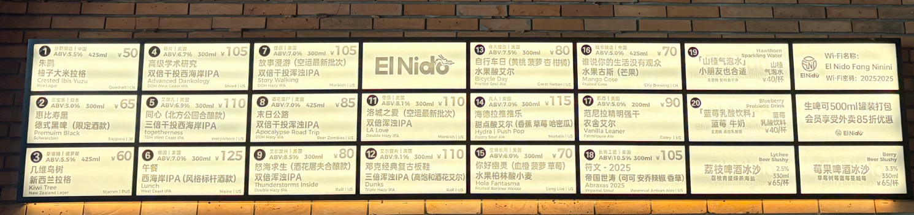</a> IMG-B002|请逐行识别这张酒单，保留印刷编号、酒名、酒厂、价格和容量；看不清的字段请说明 逐字段识别、来源边界与上下文正确性|参考答案已冻结；识图受阻|仓库既有基线|
|IMG-B003|<a href="../../public/test-assets/can-monkish-la-love.png">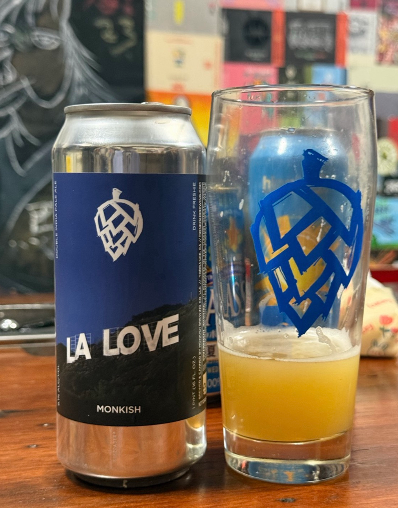</a> IMG-B003|这是什么酒？只根据图片说明酒名、酒厂、风格、ABV，无法辨认的字段请说明 逐字段识别、来源边界与上下文正确性|参考答案已冻结；识图受阻|仓库既有基线|
|IMG-B004|<a href="../../public/test-assets/marketing-lunch-dinner.png">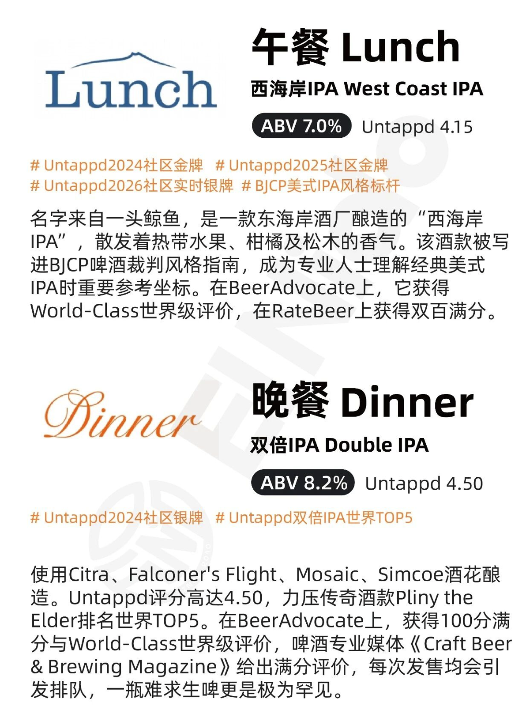</a> IMG-B004|图里有哪些酒，图中文字的ABV和评分分别是什么？这些信息是否是已核实的当前信息？ 逐字段识别、来源边界与上下文正确性|参考答案已冻结；识图受阻|仓库既有基线|
|IMG-D001|<a href="../../tests/fixtures/image-dataset/images/IMG-D001.png">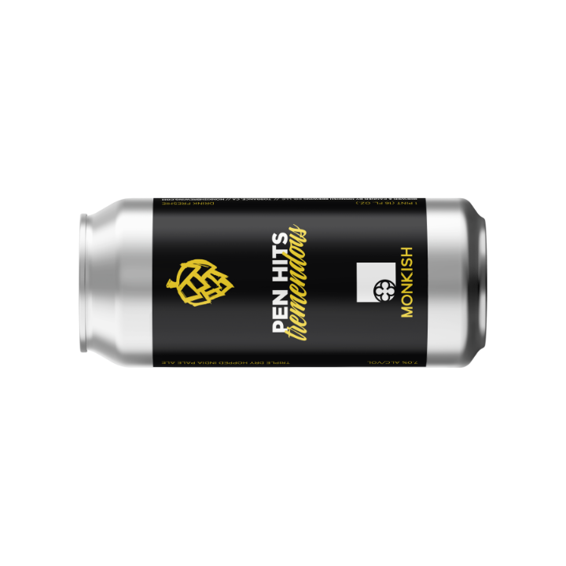</a> IMG-D001|请只根据图片说明画面对象、酒名、酒厂、风格、ABV和容量；看不清的请明确说明，图中没有的价格和评分不要补造。 逐字段识别、来源边界与上下文正确性|参考答案已冻结；识图受阻|父图 IMG-N003|
|IMG-D002|<a href="../../tests/fixtures/image-dataset/images/IMG-D002.png">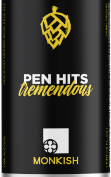</a> IMG-D002|请只根据图片说明画面对象、酒名、酒厂、风格、ABV和容量；看不清的请明确说明，图中没有的价格和评分不要补造。 逐字段识别、来源边界与上下文正确性|参考答案已冻结；识图受阻|父图 IMG-N003|
|IMG-D003|<a href="../../tests/fixtures/image-dataset/images/IMG-D003.png">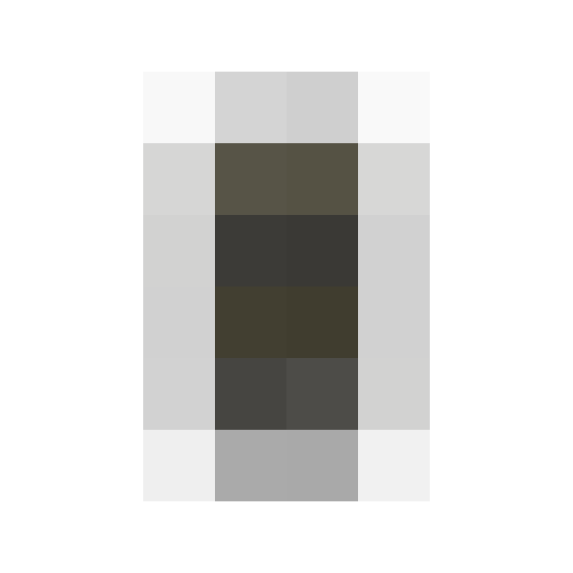</a> IMG-D003|请识别这张新图；如果字不可辨认请说明。不要用之前图片的酒名、编号或价格当作本图结果。 逐字段识别、来源边界与上下文正确性|参考答案已冻结；识图受阻|父图 IMG-N003|
|IMG-D004|<a href="../../tests/fixtures/image-dataset/images/IMG-D004.png">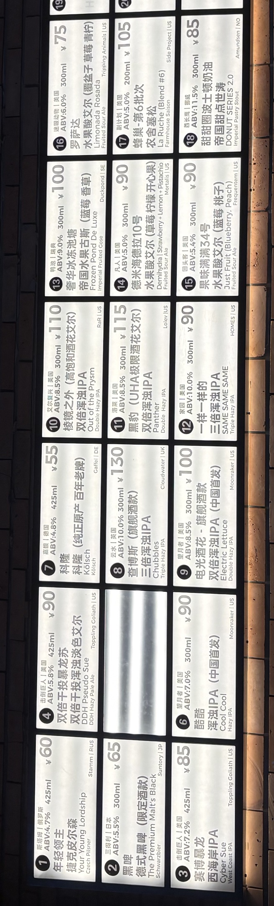</a> IMG-D004|请识别这张酒单，保留印刷编号、酒名、酒厂、价格和容量；无法辨认请说明。 逐字段识别、来源边界与上下文正确性|参考答案已冻结；识图受阻|父图 IMG-B001|
|IMG-D005| IMG-D005|请识别这张新图；如果字不可辨认请说明。不要用之前图片的酒名、编号或价格当作本图结果。 逐字段识别、来源边界与上下文正确性|参考答案已冻结；识图受阻|父图 IMG-B001|
|IMG-D006|<a href="../../tests/fixtures/image-dataset/images/IMG-D006.png">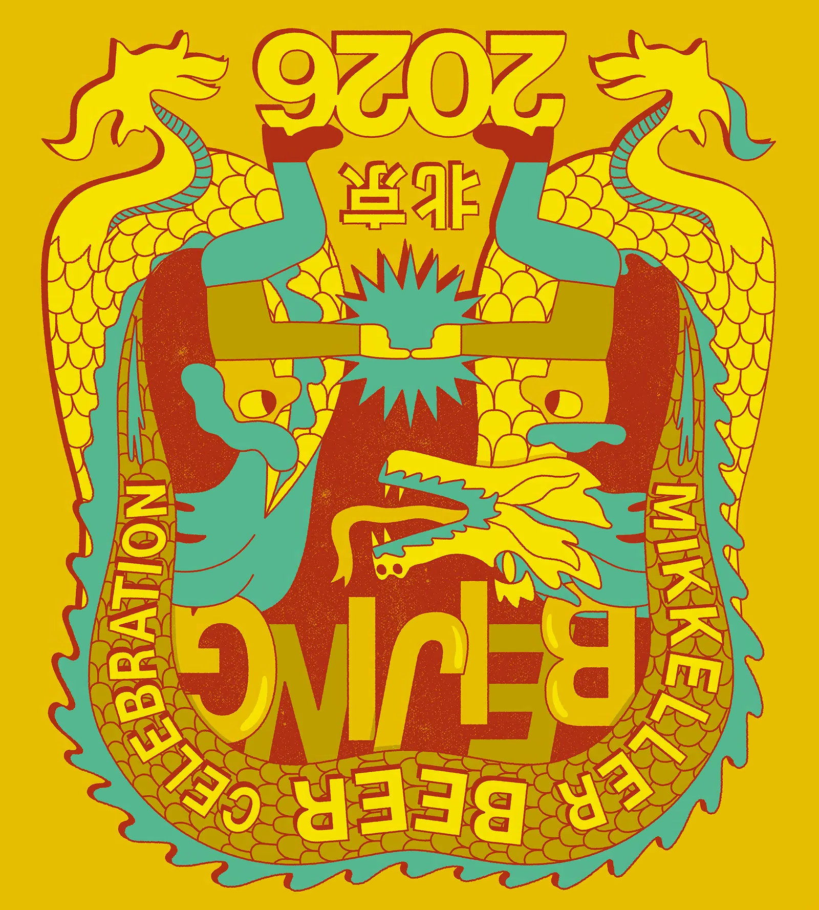</a> IMG-D006|这张图是什么活动、哪个城市和哪一年？仅凭这张图能否确认该届活动的参展酒厂和现场酒款？ 逐字段识别、来源边界与上下文正确性|参考答案已冻结；识图受阻|父图 IMG-N023|
|IMG-E001|<a href="../../tests/fixtures/image-dataset/images/IMG-E001.jpg">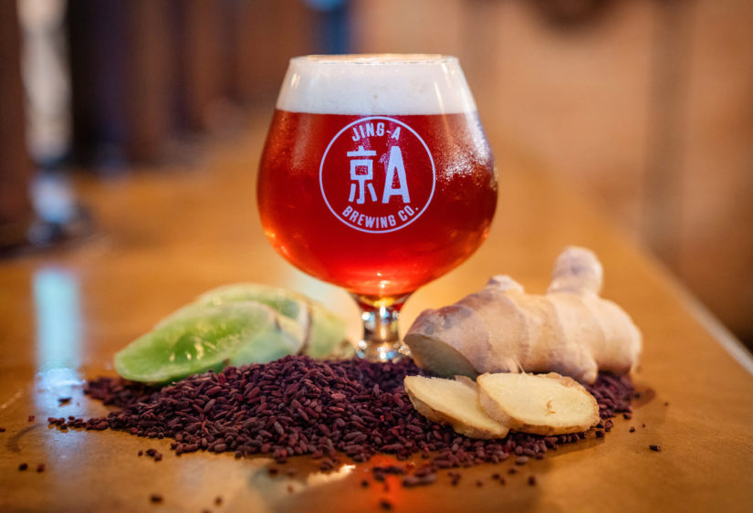</a> 京A杯装红色酒液场景|请只根据这张图说明是什么、能确认哪些信息、哪些不能确认；不要用官网资料补成图上文字。 杯上仅确认京A品牌，不能用背景食材或酒色确认酒名。|已人工目检；完整字段待标注；未跑模型|[官方页面](https://jingabrewing.com/beers/)|
|IMG-E002|<a href="../../tests/fixtures/image-dataset/images/IMG-E002.jpg">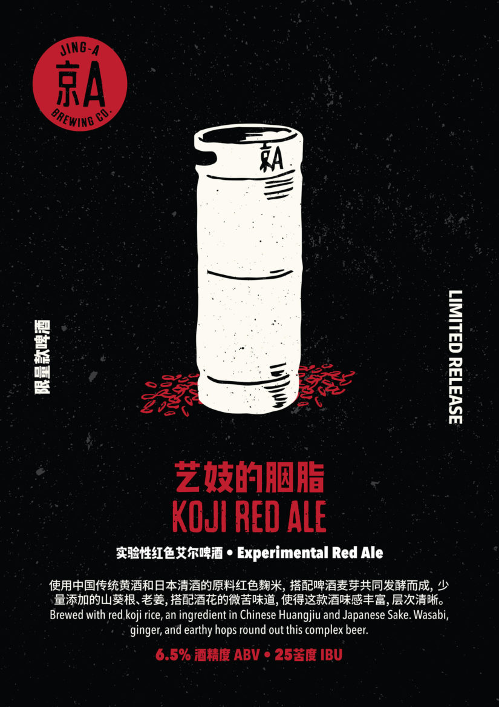</a> 京A艺妓的胭脂海报|请只根据这张图说明是什么、能确认哪些信息、哪些不能确认；不要用官网资料补成图上文字。 确认KOJI RED ALE；数字需看原图核对，海报不代表当前在售。|已人工目检；完整字段待标注；未跑模型|[官方页面](https://jingabrewing.com/beers/)|
|IMG-E003|<a href="../../tests/fixtures/image-dataset/images/IMG-E003.jpg">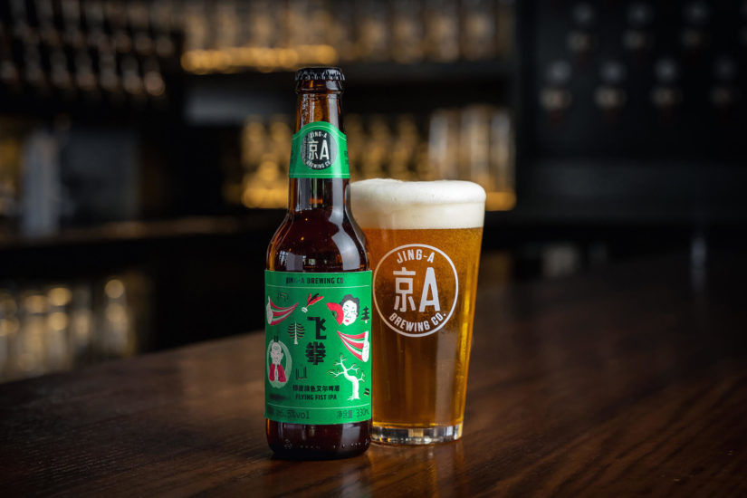</a> 京A飞拳瓶装与杯装|请只根据这张图说明是什么、能确认哪些信息、哪些不能确认；不要用官网资料补成图上文字。 瓶标可用于身份，杯标不能独立证明杯中是同款。|已人工目检；完整字段待标注；未跑模型|[官方页面](https://jingabrewing.com/beers/)|
|IMG-E004|<a href="../../tests/fixtures/image-dataset/images/IMG-E004.jpg">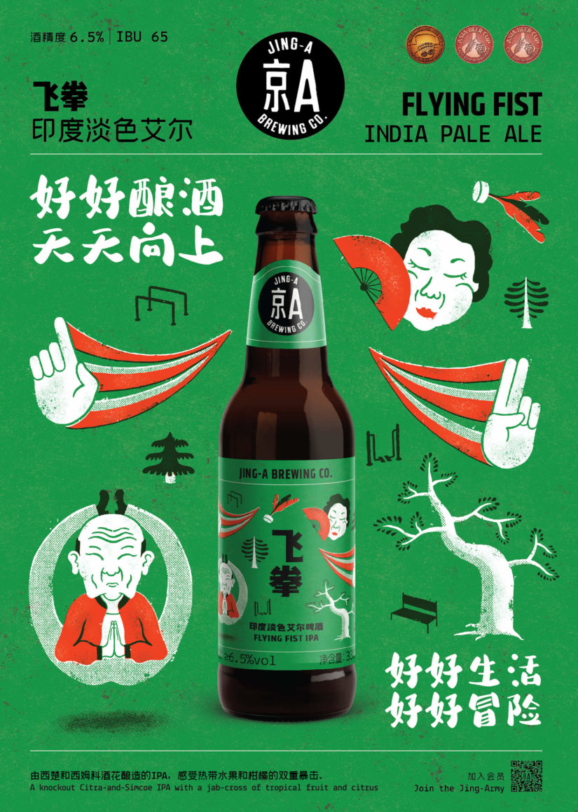</a> 京A飞拳双语海报|请只根据这张图说明是什么、能确认哪些信息、哪些不能确认；不要用官网资料补成图上文字。 区分酒名、风格、ABV和IBU，宣传语不当酒名。|已人工目检；完整字段待标注；未跑模型|[官方页面](https://jingabrewing.com/beers/)|
|IMG-E005|<a href="../../tests/fixtures/image-dataset/images/IMG-E005.jpg">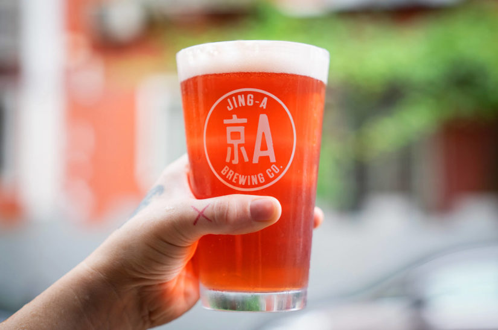</a> 京A杯装琥珀色酒液场景|请只根据这张图说明是什么、能确认哪些信息、哪些不能确认；不要用官网资料补成图上文字。 只确认杯上品牌；不从颜色和网页品名补造身份。|已人工目检；完整字段待标注；未跑模型|[官方页面](https://jingabrewing.com/beers/)|
|IMG-E006|<a href="../../tests/fixtures/image-dataset/images/IMG-E006.jpg">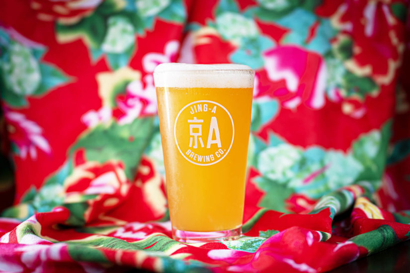</a> 京A花布背景杯装场景|请只根据这张图说明是什么、能确认哪些信息、哪些不能确认；不要用官网资料补成图上文字。 只有杯上品牌，背景不能证明酒名或产地。|已人工目检；完整字段待标注；未跑模型|[官方页面](https://jingabrewing.com/beers/)|
|IMG-E007|<a href="../../tests/fixtures/image-dataset/images/IMG-E007.jpg">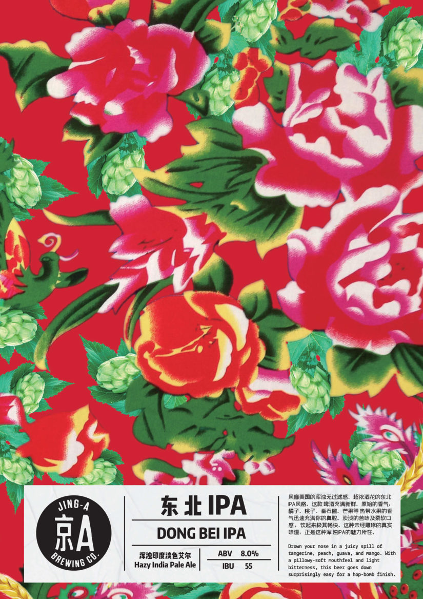</a> 京A东北IPA海报|请只根据这张图说明是什么、能确认哪些信息、哪些不能确认；不要用官网资料补成图上文字。 同一中英文酒名不要拆成两款；下方细字放大核对。|已人工目检；完整字段待标注；未跑模型|[官方页面](https://jingabrewing.com/beers/)|
|IMG-E008|<a href="../../tests/fixtures/image-dataset/images/IMG-E008.jpg">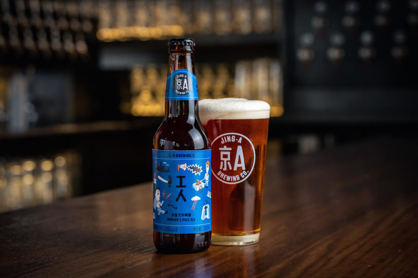</a> 京A工人瓶装与杯装|请只根据这张图说明是什么、能确认哪些信息、哪些不能确认；不要用官网资料补成图上文字。 读取瓶标；不从杯形推算容量。|已人工目检；完整字段待标注；未跑模型|[官方页面](https://jingabrewing.com/beers/)|
|IMG-E009|<a href="../../tests/fixtures/image-dataset/images/IMG-E009.jpg">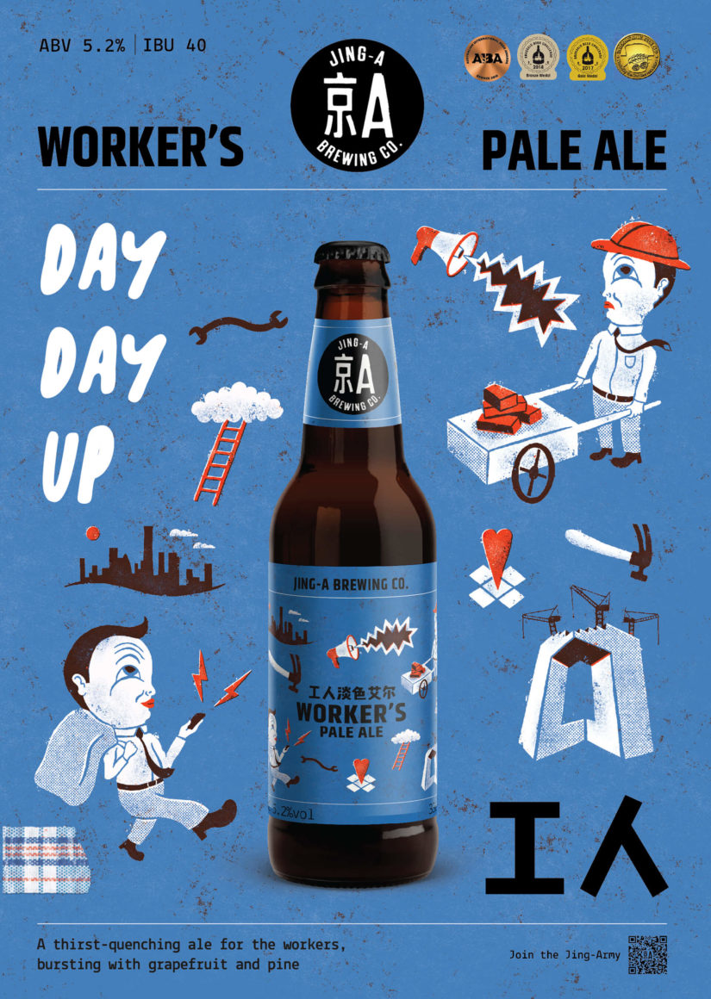</a> 京A工人淡色艾尔海报|请只根据这张图说明是什么、能确认哪些信息、哪些不能确认；不要用官网资料补成图上文字。 区分WORKER’S PALE ALE与宣传语；不把奖牌当评分。|已人工目检；完整字段待标注；未跑模型|[官方页面](https://jingabrewing.com/beers/)|
|IMG-E010|<a href="../../tests/fixtures/image-dataset/images/IMG-E010.jpg">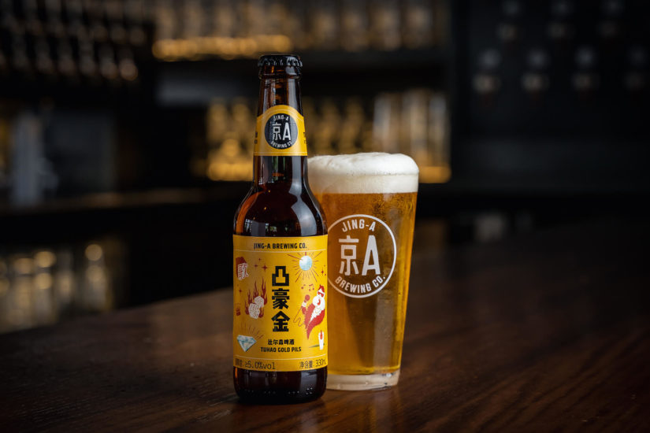</a> 京A土豪金瓶装与杯装|请只根据这张图说明是什么、能确认哪些信息、哪些不能确认；不要用官网资料补成图上文字。 区分瓶标和杯上品牌，售价与容量未知。|已人工目检；完整字段待标注；未跑模型|[官方页面](https://jingabrewing.com/beers/)|
|IMG-E011|<a href="../../tests/fixtures/image-dataset/images/IMG-E011.jpg">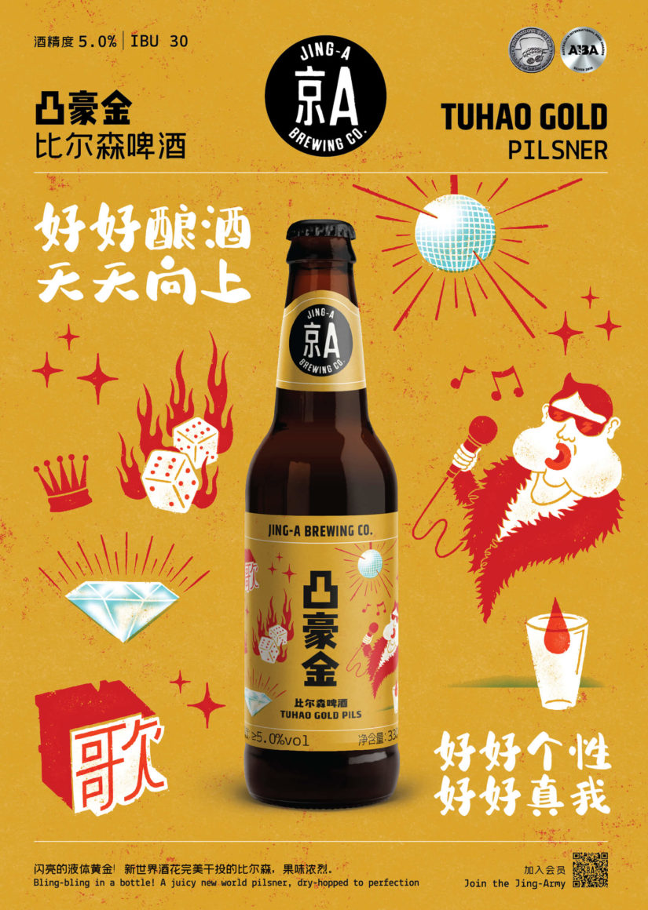</a> 京A土豪金海报|请只根据这张图说明是什么、能确认哪些信息、哪些不能确认；不要用官网资料补成图上文字。 区分皮尔森风格、ABV和IBU；不补售价。|已人工目检；完整字段待标注；未跑模型|[官方页面](https://jingabrewing.com/beers/)|
|IMG-E012|<a href="../../tests/fixtures/image-dataset/images/IMG-E012.jpg">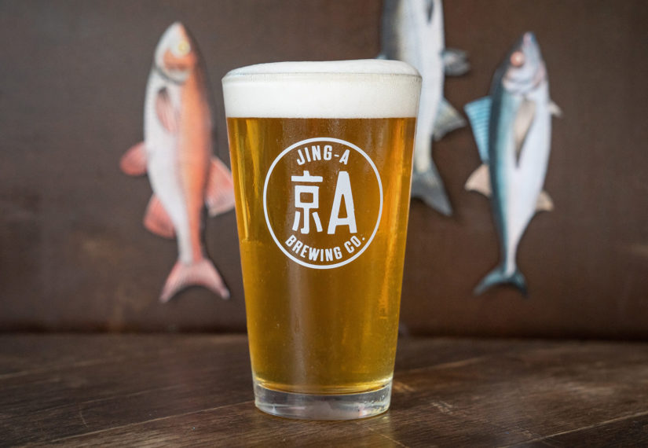</a> 京A杯装浅色酒液场景|请只根据这张图说明是什么、能确认哪些信息、哪些不能确认；不要用官网资料补成图上文字。 品牌可见，具体酒款无法仅凭杯子确认。|已人工目检；完整字段待标注；未跑模型|[官方页面](https://jingabrewing.com/beers/)|
|IMG-E013|<a href="../../tests/fixtures/image-dataset/images/IMG-E013.jpg">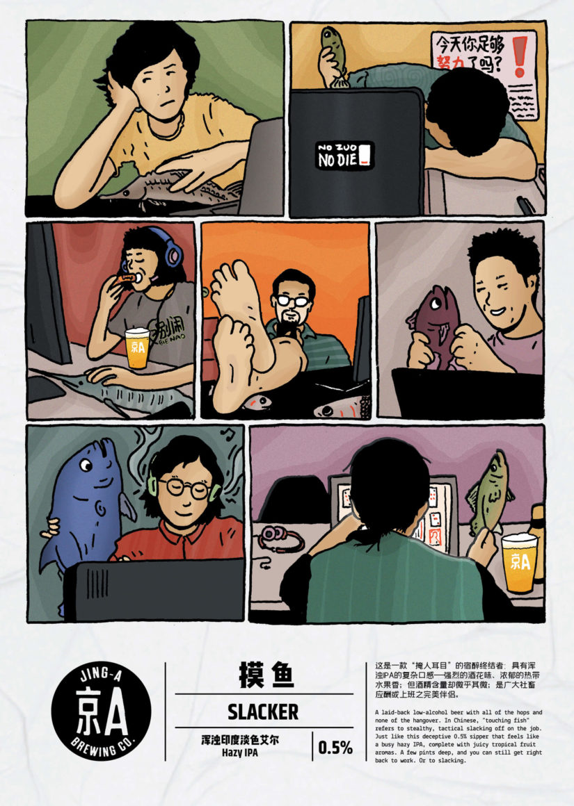</a> 京A摸鱼漫画海报|请只根据这张图说明是什么、能确认哪些信息、哪些不能确认；不要用官网资料补成图上文字。 漫画人物/对白不是菜单条目，酒名SLACKER。|已人工目检；完整字段待标注；未跑模型|[官方页面](https://jingabrewing.com/beers/)|
|IMG-E014|<a href="../../tests/fixtures/image-dataset/images/IMG-E014.jpg">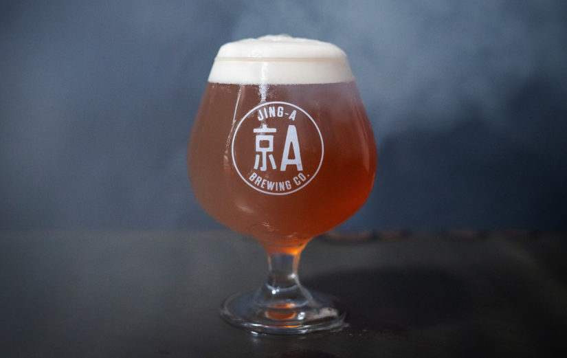</a> 京A杯装深色酒液场景|请只根据这张图说明是什么、能确认哪些信息、哪些不能确认；不要用官网资料补成图上文字。 背景来源产品名不等于图中酒名。|已人工目检；完整字段待标注；未跑模型|[官方页面](https://jingabrewing.com/beers/)|
|IMG-E015|<a href="../../tests/fixtures/image-dataset/images/IMG-E015.jpg">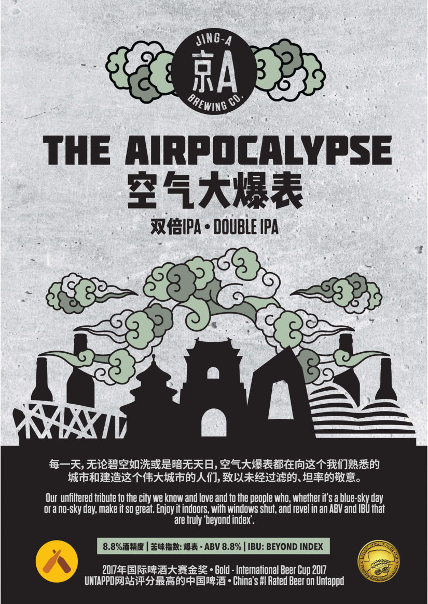</a> 京A空气大爆表海报|请只根据这张图说明是什么、能确认哪些信息、哪些不能确认；不要用官网资料补成图上文字。 酒名与夸张苦度文案分开，IBU宣传语不得编数值。|已人工目检；完整字段待标注；未跑模型|[官方页面](https://jingabrewing.com/beers/)|
|IMG-E016|<a href="../../tests/fixtures/image-dataset/images/IMG-E016.jpg">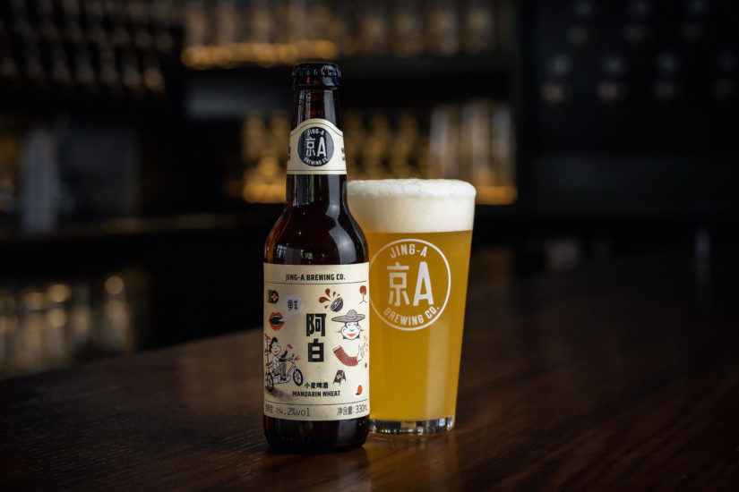</a> 京A阿白瓶装与杯装|请只根据这张图说明是什么、能确认哪些信息、哪些不能确认；不要用官网资料补成图上文字。 瓶标中文与品牌分开，不从官网补不可读字段。|已人工目检；完整字段待标注；未跑模型|[官方页面](https://jingabrewing.com/beers/)|
|IMG-E020|<a href="../../tests/fixtures/image-dataset/images/IMG-E020.webp">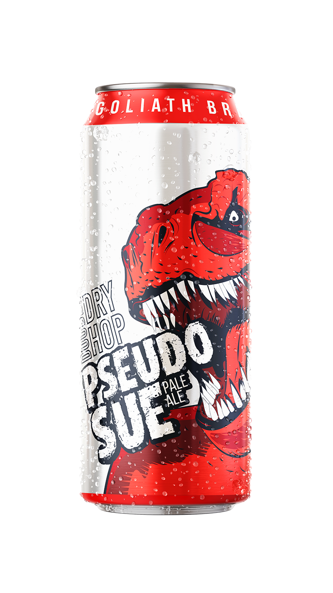</a> 双倍干投Pseudo Sue罐图|请只根据这张图说明是什么、能确认哪些信息、哪些不能确认；不要用官网资料补成图上文字。 与普通Pseudo Sue和King Sue分开；品牌不是酒名。|已人工目检；完整字段待标注；未跑模型|[官方页面](https://www.tgbrews.com/beer)|
|IMG-E022|<a href="../../tests/fixtures/image-dataset/images/IMG-E022.webp">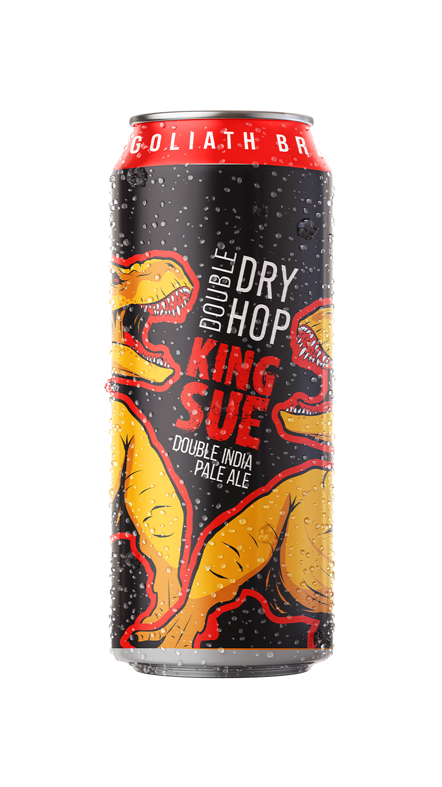</a> 双倍干投King Sue罐图|请只根据这张图说明是什么、能确认哪些信息、哪些不能确认；不要用官网资料补成图上文字。 保留DOUBLE DRY HOP变体，不与Pseudo Sue混淆。|已人工目检；完整字段待标注；未跑模型|[官方页面](https://www.tgbrews.com/beer)|
|IMG-E025|<a href="../../tests/fixtures/image-dataset/images/IMG-E025.png">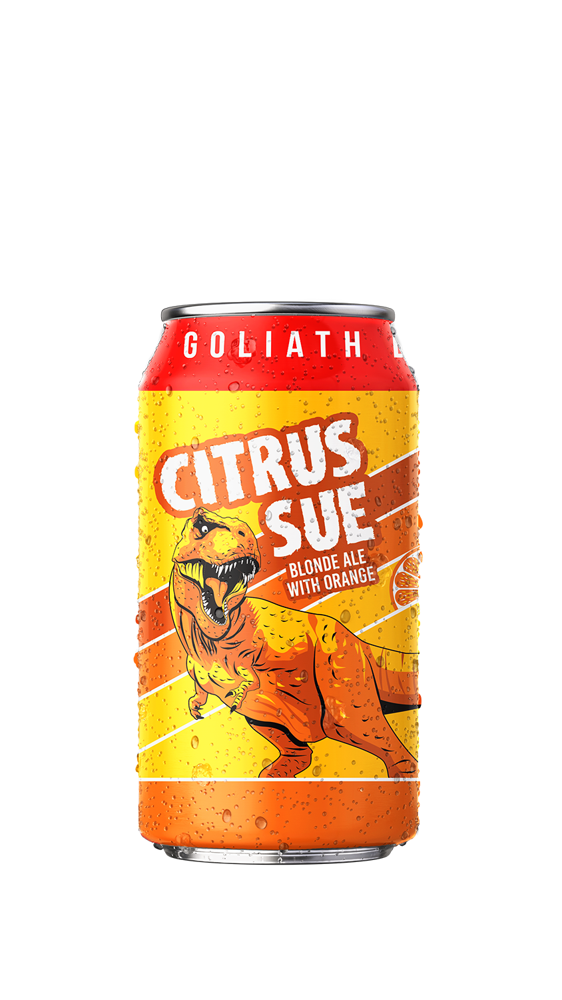</a> Citrus Sue罐图|请只根据这张图说明是什么、能确认哪些信息、哪些不能确认；不要用官网资料补成图上文字。 橙色装饰不是ABV或售价。|已人工目检；完整字段待标注；未跑模型|[官方页面](https://www.tgbrews.com/beer)|
|IMG-E026|<a href="../../tests/fixtures/image-dataset/images/IMG-E026.png">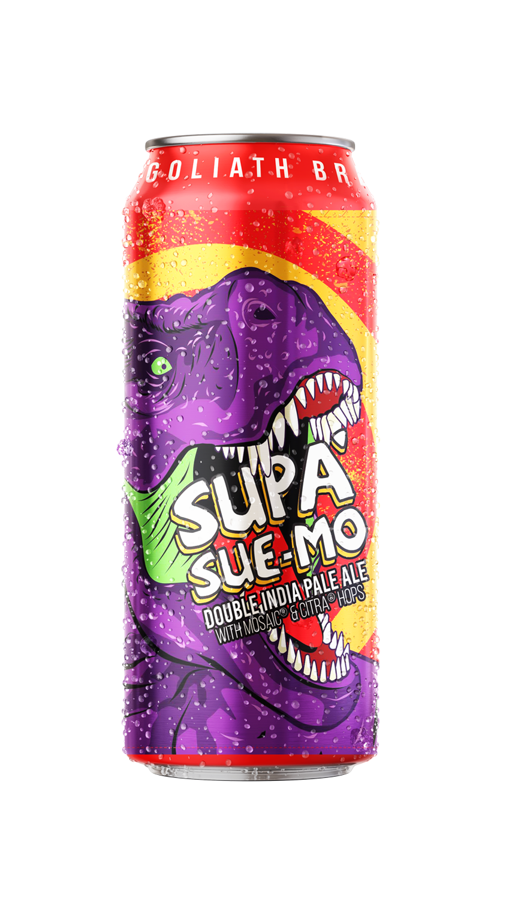</a> Supa Sue-Mo罐图|请只根据这张图说明是什么、能确认哪些信息、哪些不能确认；不要用官网资料补成图上文字。 保留酒名连字符与变体，不缩成King Sue。|已人工目检；完整字段待标注；未跑模型|[官方页面](https://www.tgbrews.com/beer)|
|IMG-E028|<a href="../../tests/fixtures/image-dataset/images/IMG-E028.png">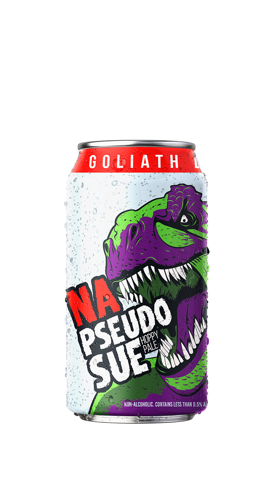</a> 无酒精Pseudo Sue罐图|请只根据这张图说明是什么、能确认哪些信息、哪些不能确认；不要用官网资料补成图上文字。 必须注意N/A和NON-ALCOHOLIC，不套普通款ABV。|已人工目检；完整字段待标注；未跑模型|[官方页面](https://www.tgbrews.com/beer)|
|IMG-E029|<a href="../../tests/fixtures/image-dataset/images/IMG-E029.jpg">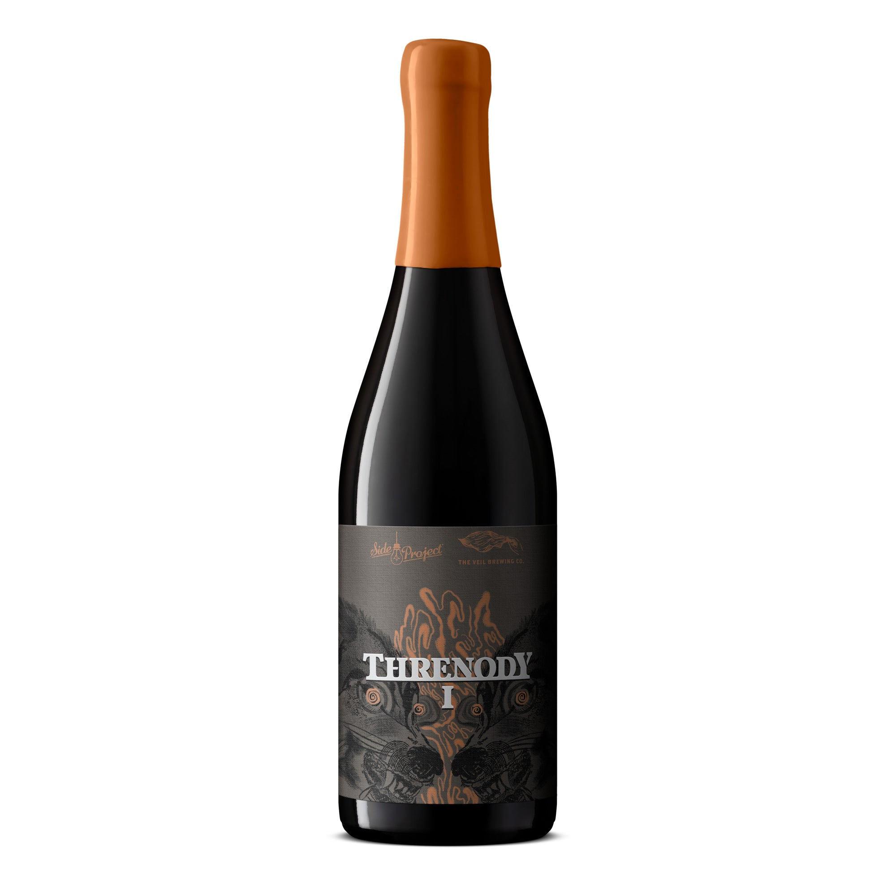</a> Side Project Threnody瓶图|请只根据这张图说明是什么、能确认哪些信息、哪些不能确认；不要用官网资料补成图上文字。 只识别可见THRENODY，发布版本需独立证据。|已人工目检；完整字段待标注；未跑模型|[官方页面](https://www.sideprojectbrewing.com/products/threnody-i-barleywine-collaboration-with-the-veil)|
|IMG-E030|<a href="../../tests/fixtures/image-dataset/images/IMG-E030.jpg">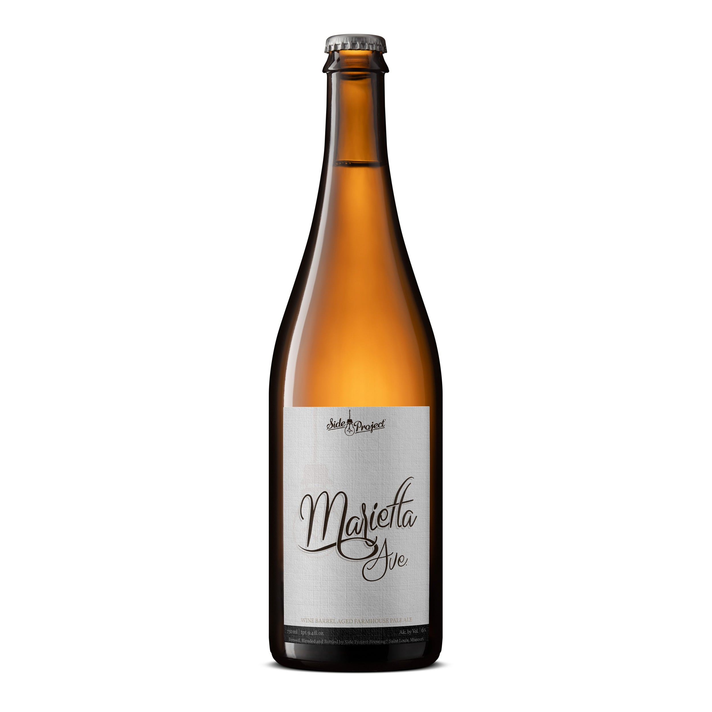</a> Side Project Marietta Ave瓶图|请只根据这张图说明是什么、能确认哪些信息、哪些不能确认；不要用官网资料补成图上文字。 网页2026版本信息不得声称从图读取。|已人工目检；完整字段待标注；未跑模型|[官方页面](https://www.sideprojectbrewing.com/products/marietta-ave-2026)|
|IMG-E031|<a href="../../tests/fixtures/image-dataset/images/IMG-E031.jpg">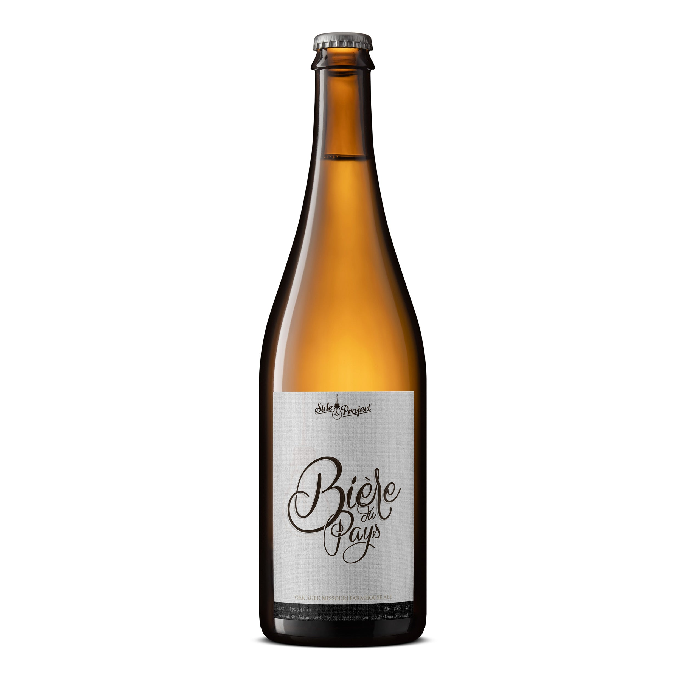</a> Side Project Bière du Pays瓶图|请只根据这张图说明是什么、能确认哪些信息、哪些不能确认；不要用官网资料补成图上文字。 保留法文重音；不把页面版本当标签事实。|已人工目检；完整字段待标注；未跑模型|[官方页面](https://www.sideprojectbrewing.com/products/biere-du-pays-blend-13)|
|IMG-E032|<a href="../../tests/fixtures/image-dataset/images/IMG-E032.jpg">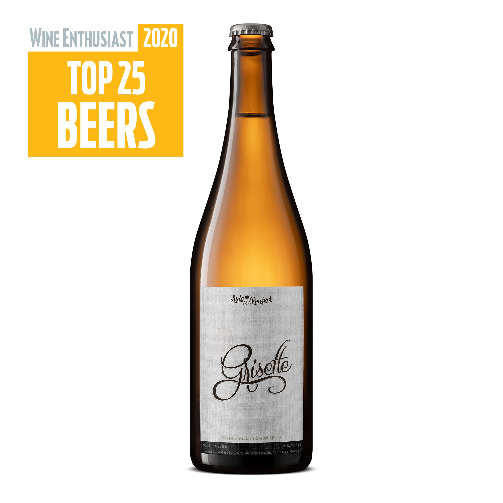</a> Side Project Grisette含旧奖项图|请只根据这张图说明是什么、能确认哪些信息、哪些不能确认；不要用官网资料补成图上文字。 TOP 25 BEERS 2020是图示历史奖项，不是当前评分。|已人工目检；完整字段待标注；未跑模型|[官方页面](https://www.sideprojectbrewing.com/products/grisette-blend-11)|
|IMG-E033|<a href="../../tests/fixtures/image-dataset/images/IMG-E033.jpg">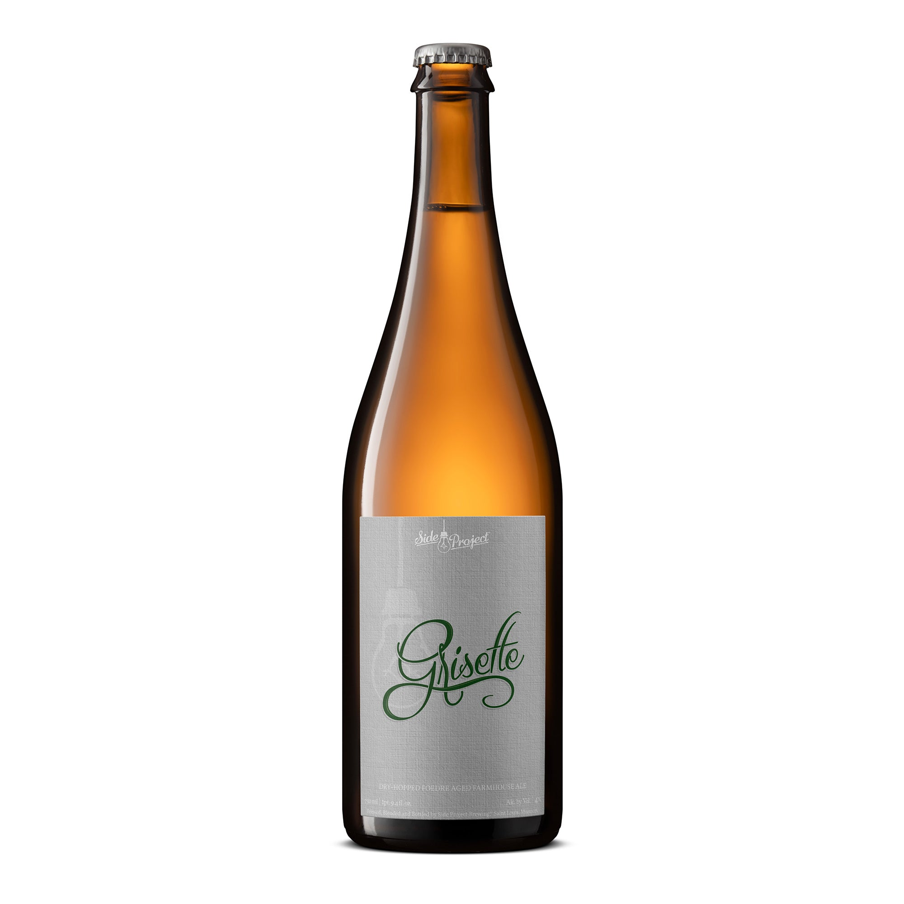</a> Side Project绿色Grisette标签图|请只根据这张图说明是什么、能确认哪些信息、哪些不能确认；不要用官网资料补成图上文字。 同名近似包装与另一Grisette同族；干投信息未清晰读出时说明。|已人工目检；完整字段待标注；未跑模型|[官方页面](https://www.sideprojectbrewing.com/products/dry-hopped-grisette-2027)|
|IMG-E034|<a href="../../tests/fixtures/image-dataset/images/IMG-E034.jpg">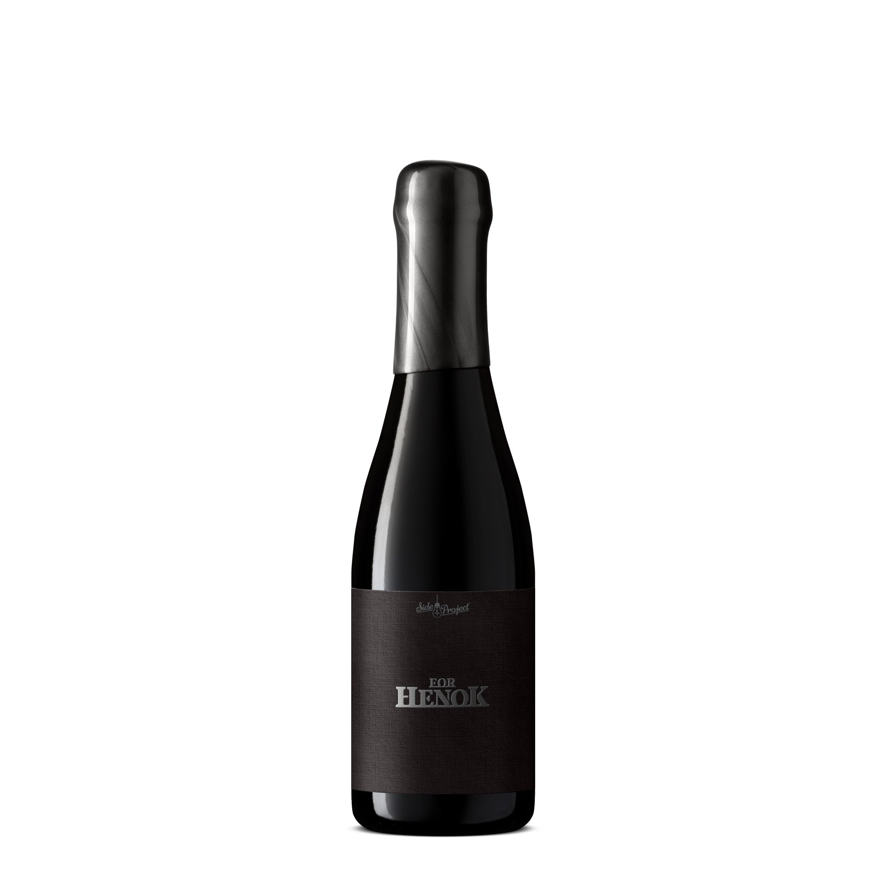</a> Side Project For Henok瓶图|请只根据这张图说明是什么、能确认哪些信息、哪些不能确认；不要用官网资料补成图上文字。 深色标签不补造ABV、容量。|已人工目检；完整字段待标注；未跑模型|[官方页面](https://www.sideprojectbrewing.com/products/for-henok)|
|IMG-E035|<a href="../../tests/fixtures/image-dataset/images/IMG-E035.jpg">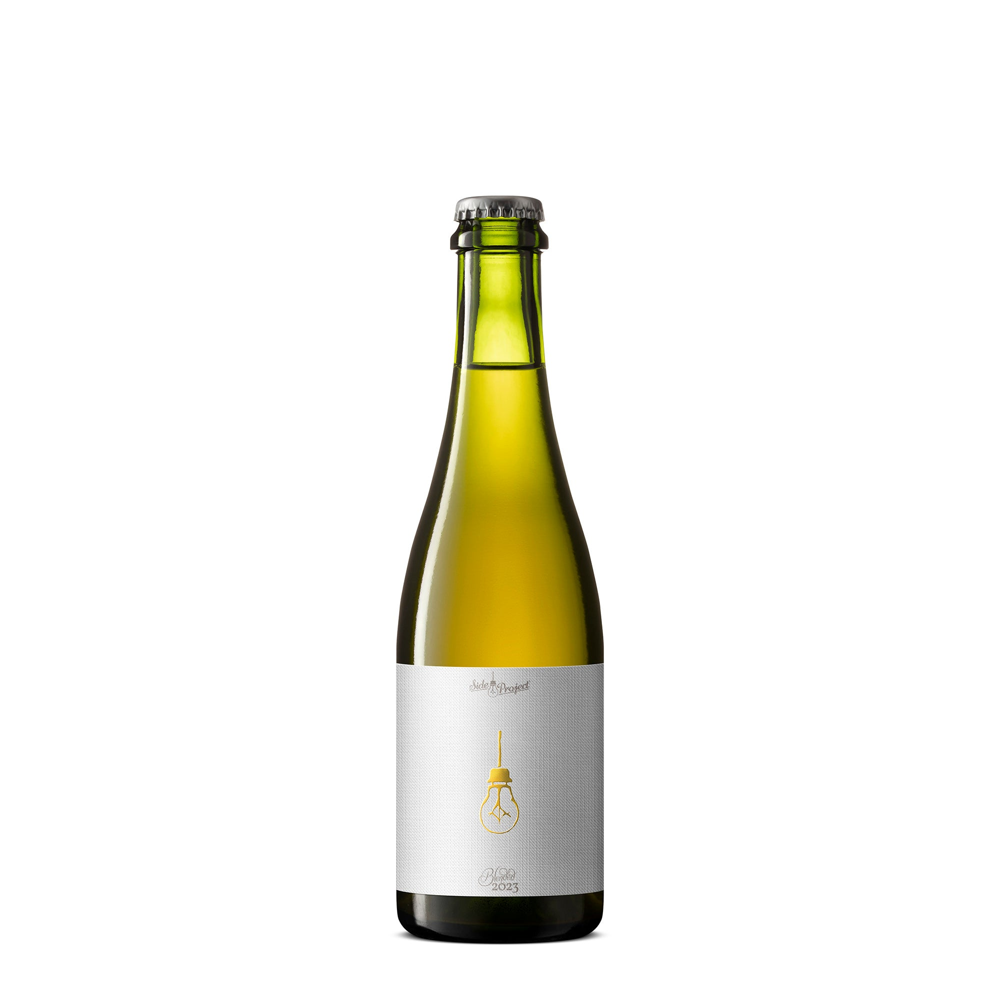</a> Side Project极简标签绿瓶图|请只根据这张图说明是什么、能确认哪些信息、哪些不能确认；不要用官网资料补成图上文字。 小字无法稳读时仅报告可见对象，不能用网页Blended 2017强填酒名。|已人工目检；完整字段待标注；未跑模型|[官方页面](https://www.sideprojectbrewing.com/products/blended-2017)|
|IMG-E036|<a href="../../tests/fixtures/image-dataset/images/IMG-E036.jpg">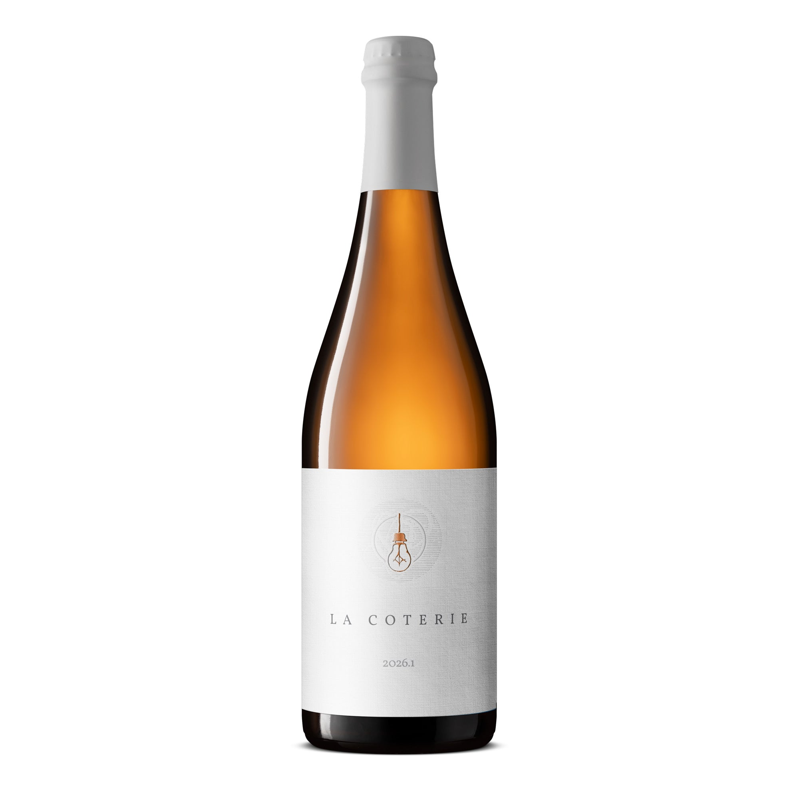</a> Side Project La Coterie瓶图|请只根据这张图说明是什么、能确认哪些信息、哪些不能确认；不要用官网资料补成图上文字。 细字版本待原图核对，售价未知。|已人工目检；完整字段待标注；未跑模型|[官方页面](https://www.sideprojectbrewing.com/products/lc-2026-1)|
|IMG-E037|<a href="../../tests/fixtures/image-dataset/images/IMG-E037.jpg">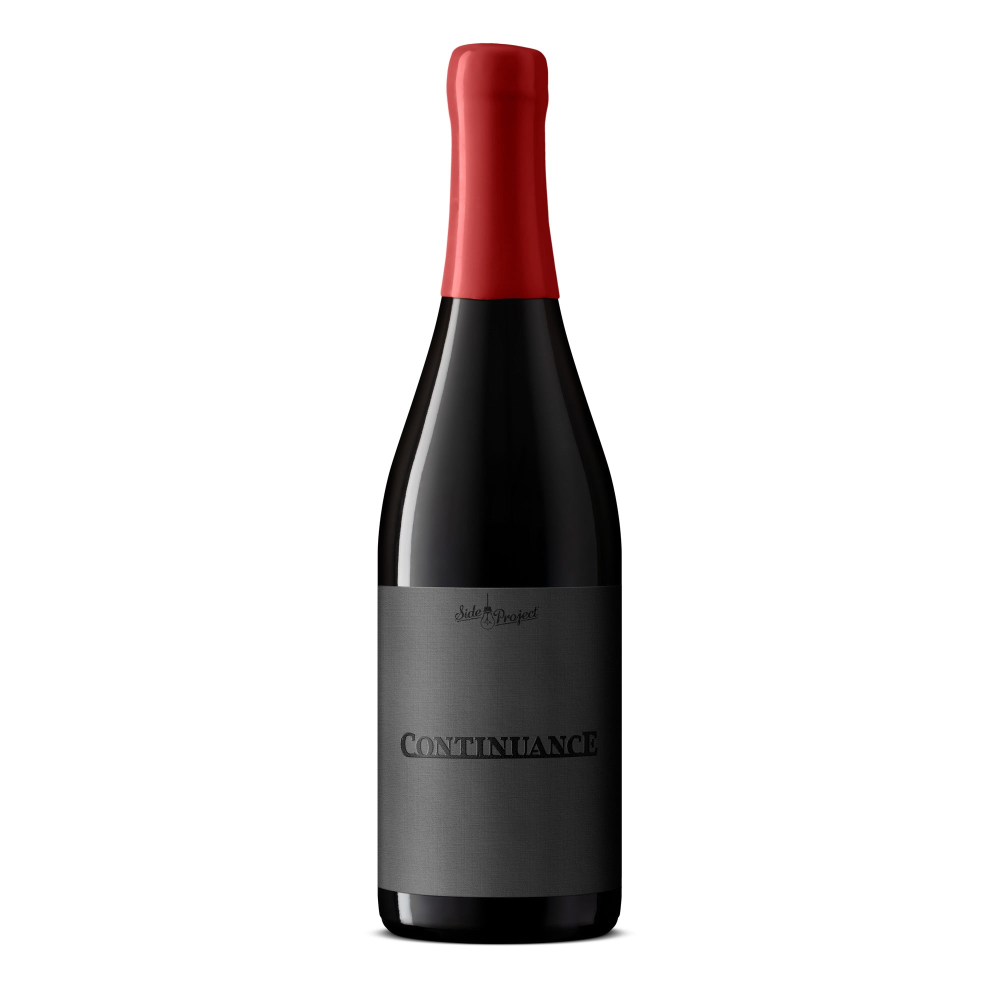</a> Side Project Continuance瓶图|请只根据这张图说明是什么、能确认哪些信息、哪些不能确认；不要用官网资料补成图上文字。 不从来源页补Blend #8为图中可见事实。|已人工目检；完整字段待标注；未跑模型|[官方页面](https://www.sideprojectbrewing.com/products/continuance-8)|
|IMG-E038|<a href="../../tests/fixtures/image-dataset/images/IMG-E038.jpg">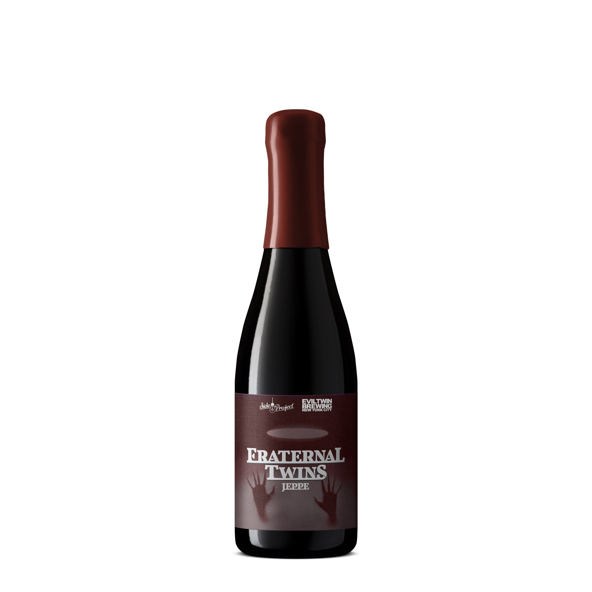</a> Side Project Fraternal Twins瓶图|请只根据这张图说明是什么、能确认哪些信息、哪些不能确认；不要用官网资料补成图上文字。 保留Jeppe变体，避免与Cory混淆。|已人工目检；完整字段待标注；未跑模型|[官方页面](https://www.sideprojectbrewing.com/products/fraternal-twins-jeppe)|
|IMG-E040|<a href="../../tests/fixtures/image-dataset/images/IMG-E040.png">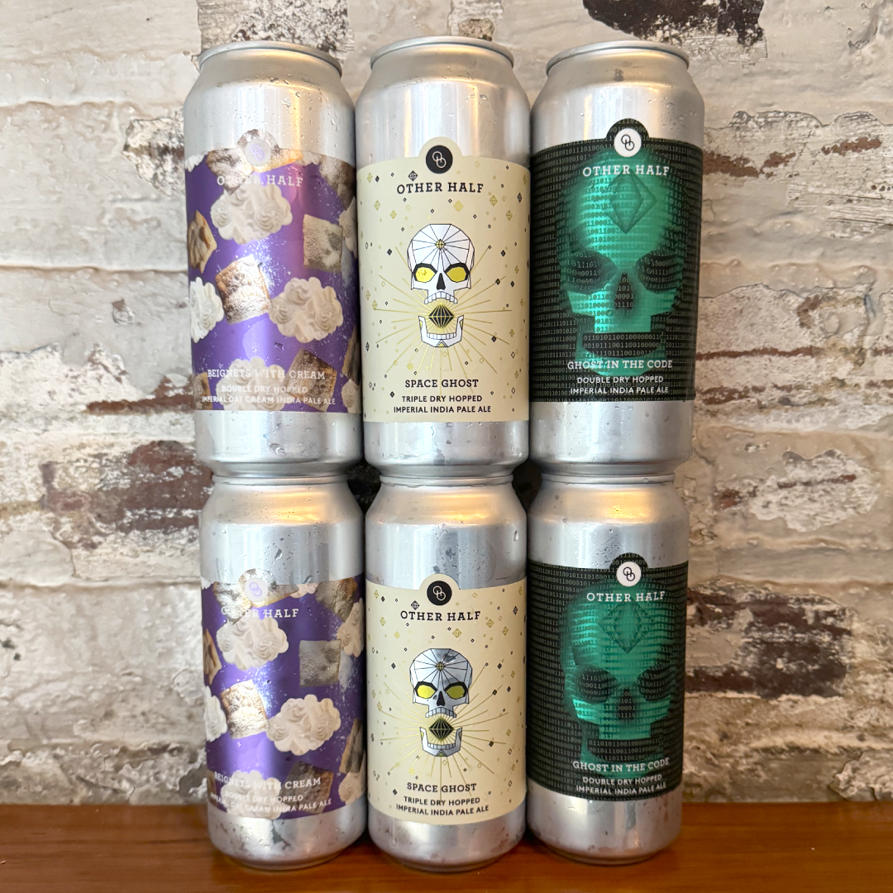</a> Other Half与Parish多罐合影|请只根据这张图说明是什么、能确认哪些信息、哪些不能确认；不要用官网资料补成图上文字。 6个罐不等于6种酒；分辨重复列与不同酒款，不靠位置猜模糊酒名。|已人工目检；完整字段待标注；未跑模型|[官方页面](https://store.otherhalfbrewing.com/product/parish-collab-box-2026/)|
|IMG-E041|<a href="../../tests/fixtures/image-dataset/images/IMG-E041.jpg">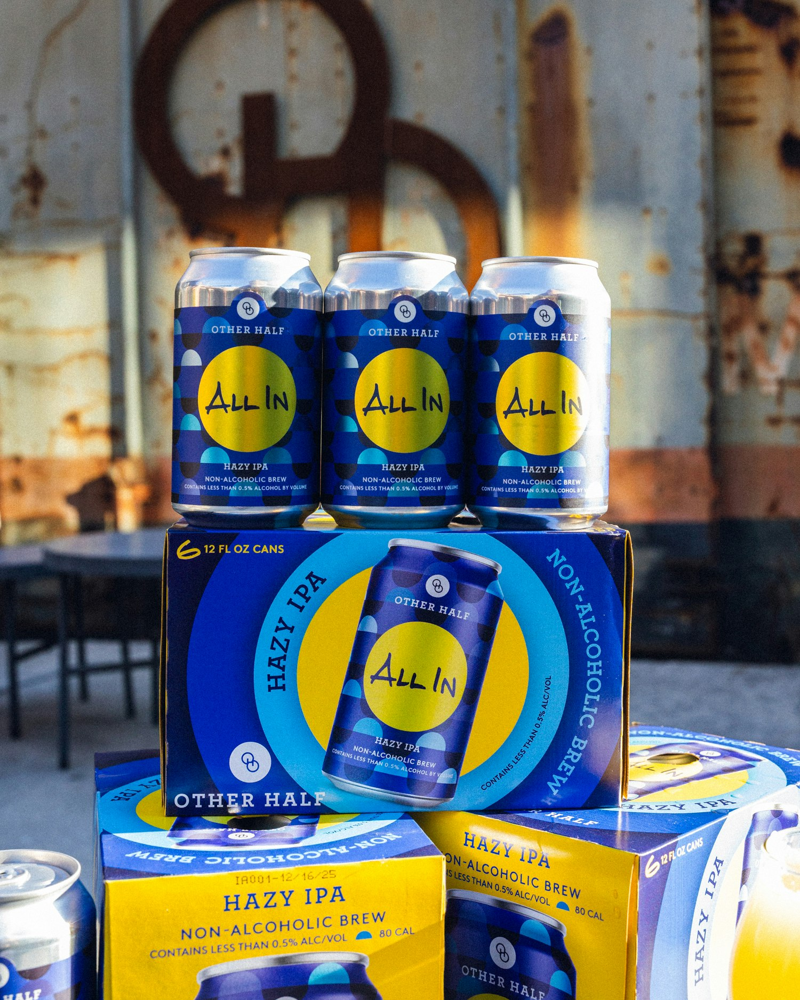</a> Other Half All In无酒精组合图|请只根据这张图说明是什么、能确认哪些信息、哪些不能确认；不要用官网资料补成图上文字。 注意NON-ALCOHOLIC和含量阈值；不能说绝对0酒精，也不能当普通IPA。|已人工目检；完整字段待标注；未跑模型|[官方页面](https://store.otherhalfbrewing.com/product/all-in-case/)|
