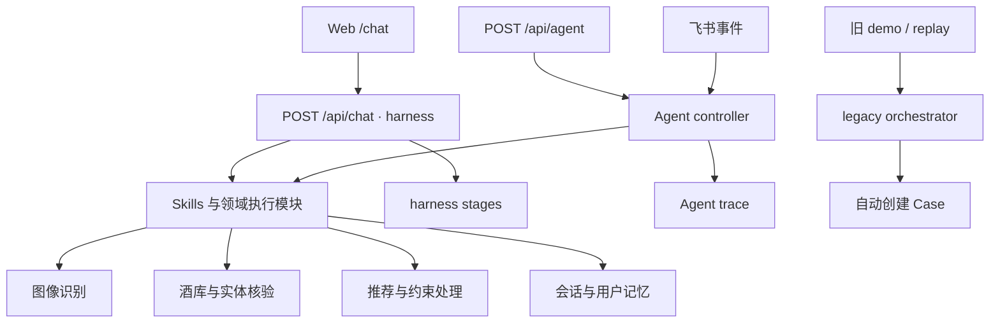

# 开发与架构

项目定位和样本见 [README](../README.md)。本文描述当前入口与开发工具；已知缺陷集中在 [测试说明](testing.md)。

## 模型配置

需要 Node.js 22.19+、npm；SQLite 查询需要 Python 3.9+。从 [`.env.example`](../.env.example) 复制到 `.env.local`，填入自己可用的提供者配置。

| 配置 | 作用 |
| :--- | :--- |
| `LLM_BASE_URL`、`LLM_API_KEY`、`LLM_MODEL` | `/api/chat` 的 harness 路由模型；三项必须非空，支持 OpenAI 兼容接口 |
| `OPENROUTER_API_KEY` | 现有知识、视觉及 Agent 相关 OpenRouter 调用 |
| `OPENROUTER_MODEL` | 现有 OpenRouter 提供者的通用模型配置 |
| `OPENROUTER_ANALYSIS_MODEL` | 可选；知识 Skill 使用，不设置时沿用代码默认值 |
| `OPENROUTER_VISION_MODEL` | 可选；酒标 Skill 使用，应选择支持图片的模型 |
| `VISION_FALLBACK_MODELS` | 可选；多阶段图像管线的视觉回退模型列表，以逗号分隔 |
| `DEBUG_API_TOKEN` | 可选；受保护的调试接口凭据 |

可以使用同一提供者，但 `LLM_*` 与 `OPENROUTER_*` 目前仍是分别配置的调用路径。可选模型变量不使用时请省略，不要填空字符串覆盖默认值。修改环境变量后重启服务。

```bash
npm ci
cp .env.example .env.local
# 填好模型配置后启动
npm run dev
```

`npm run check` 依次运行代码测试、类型检查、生产构建。要验证生产模式，停止开发服务后执行检查，再运行 `npm run start -- --hostname 127.0.0.1 --port 3000`。

## 当前入口



`/api/chat` 与 `/api/agent` 不是同一个统一入口。当前聊天主要记录 harness stages，Agent controller 记录 trace；自动创建 Case 的调用仍在旧 orchestrator，不能假设当前每次对话都会自动出现在 Cases 中。

| 位置 | 用途 |
| :--- | :--- |
| [`app/api/chat/route.ts`](../app/api/chat/route.ts) | 流式聊天、路由和 Skill 调用 |
| [`lib/agent/controller.ts`](../lib/agent/controller.ts) | `/api/agent` 与飞书的 Agent 调度 |
| [`lib/skills/`](../lib/skills/) | 推荐、视觉、知识、反馈、画像与纠错模块 |
| [`lib/harness/`](../lib/harness/) | LLM 适配、规则、运行注册表与可观察执行 |
| [`lib/beer-agent/orchestrator.ts`](../lib/beer-agent/orchestrator.ts) | 旧 demo / replay 的编排入口 |
| [`lib/beer-agent/beer-db/`](../lib/beer-agent/beer-db/) | 数据查询、补全与采集 |
| [`lib/beer-agent/memory/`](../lib/beer-agent/memory/) | 短期上下文、品饮记录与画像 |

## 会话与记忆

短期记忆按用户和会话共同生成哈希存储键，保存菜单候选和最近对话。品饮记录与画像按用户保存。Web 身份和会话由当前入口解析，不再用一个固定字符串代表所有 Web 用户。

反馈与纠错模块已经存在，但对象不明、否定表达及禁写开关仍有缺陷。验证记忆功能时，应使用隔离用户和数据目录，同时检查回复与实际存储变化。详细反例见 [测试说明](testing.md)。

## 调试与复核

| 入口 | 用途与边界 |
| :--- | :--- |
| `/debug` | Pipeline、Skills、Tester、Recent、Stats、Cases、Rules |
| `/harness` | Skill 管理界面；保存开关不代表所有执行入口已同步生效 |
| `/api/cases`、`/api/cases/[id]` | Case 查询、筛选、详情及审核修改 |
| `/api/traces/[traceId]` | Agent trace 查询 |
| `/api/debug/recent` | 最近 harness stages |
| `/api/debug/trace/[root_ts]` | 基于父子关系查看调用树 |
| `/api/debug/trace/[root_ts]/save` | 将 buffer 中的 trace 保存为 JSONL |

Cases 可编辑状态、标签和备注；配置 `DEBUG_API_TOKEN` 时需提供对应凭据。错误标签不是字段参考答案，当前原始任务导出仍需防止空答案流入评测集。

Rules 界面提供 YAML 重载，但同 ID 规则替换仍有已知缺陷。不要把按钮返回成功当作运行版本已更新。当前 replay 主要生成诊断提示，完整的新旧版本重放、比较和发布闭环尚未完成。

## Claude Code 与项目 Skill

```bash
npm run agent -- --check
npm run agent
npm run agent -- --query "飞拳是什么风格"
npm run cli -- --name 飞拳 --source json --json
```

启动器调用本机已安装的 Claude Code，显式加载 [项目 Skill](../.claude/skills/beer-lens/SKILL.md)，并沿用本机 Claude Code 权限设置。检查启动器可用不等同于所有外部 Skills 已安装或实际验证。

## 采集与巡检

```bash
npm run --silent crawl:round -- --limit 10 --print
npm run --silent inspector -- --print
npm run crawl:cli -- --help
```

`crawl:round` 生成目标清单，不执行采集。目标优先级为可选 `data/warm-list-gaps.json`、显式 `--targets` 文件、中国精酿种子；支持过滤、轮次和输出参数。`--print` 与 `--dry-run` 输出 JSON，不写文件。

巡检器读取数据、技能和日志；`regression.status=not_run` 表示没有运行测试。目标清单、实际采集与主库更新是不同阶段，目前尚未形成完整的缺口自动回写闭环。

真实采集需安装 Playwright Chromium 并显式启用：

```bash
npx playwright install chromium
BEER_LENS_LIVE=1 npm run crawl:cli -- --source untappd --limit 2
```

该 CLI 读取公开列表页和详情，支持数量上限、续跑与 JSONL 结果；默认命令和 `--dry-run` 离线，`BEER_LENS_DRY_RUN=1` 可强制离线。遇到来源拒绝访问会报告失败。其他数据适配器的代理、来源文件等配置见 `.env.example`。

可选的本地数据与 Skill Hub：

```bash
npm run hub:serve
```

默认地址为 `http://127.0.0.1:8888`。它是独立的辅助工具，普通 Beer Lens 体验只需端口 3000 的应用。Hub 读取实际日志和快照；空数据不应被解释为已采集或已验证。

新数据导入与补采规划见 [数据资产](data-assets.md)；其他接入资料见 [集成说明](integrations.md)。
